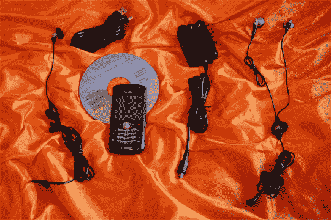

# 智能手机现在:黑莓珍珠

> 原文：<https://web.archive.org/web/http://techcrunch.com:80/2006/11/01/smartphones-now-the-blackberry-pearl/>

# 现在的智能手机:黑莓珍珠

 * [智能手机现在](https://web.archive.org/web/20130627212623/http://www.crunchgear.com/smartphones-now)是由 CrunchGear 作者在美国已经上市或即将上市的最新智能手机上开发的一组特殊功能。在这一期中，我们回顾一下 T-Mobile Pearl。*

黑莓珍珠是给女士们的。它苗条、性感、酷。这并不是说男孩可能会喜欢它，但珍珠和 Sidekick 3 一样，旨在打破障碍，将那些可能认为自己不需要智能手机的人纳入 CrackBerry 的行列。像 SK3 一样，它是一款功能齐全的智能手机，伪装成一个又酷又时尚的玩具。

[阅读本条目的其余部分](https://web.archive.org/web/20130627212623/http://crunchgear.com/2006/09/18/blackberry-pearl-8100-hands-on-2/)