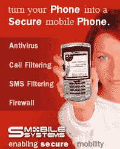

# SMobile:为您的手机提供移动安全| TechCrunch

> 原文：<https://web.archive.org/web/http://techcrunch.com/2007/05/03/smobile-mobile-security-for-your-mobile/>

 我们在 CG 公司是技术“专家”,朋友和家人经常找我们寻求生活中技术问题的解决方案。比如，一个朋友注意到他的黑莓垃圾邮件增加了。他并不介意所有的色情，但担心潜在的病毒。我说“电子邮件不会传染性病”，他说“不会，伙计，我的黑莓手机上有病毒。”我简单地回答，“你需要吸烟。”

SMobile Systems 为 Palm、Symbian、WinMo、Linux、Java 和 RIM 设备上的移动安全提供个人和网络解决方案。其 VirusGuard 产品可保护您免受通过电子邮件、SMS、MMS、直接下载、蓝牙或红外传输传送的恶意软件的攻击。

你不认为你的移动设备需要病毒防护吗？该公司预测，超过 80%的移动恶意软件将旨在利用蓝牙、Wi-Fi 和彩信等通信接口的弱点。

[斯莫比尔系统公司](https://web.archive.org/web/20150919044853/http://www.smobilesystems.com/homepage/home.jsp?lang=null)【公司所在地】