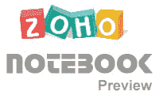

# 独家:Zoho 笔记本先睹为快 

> 原文：<https://web.archive.org/web/http://www.techcrunch.com:80/2007/01/30/sneak-peek-zoho-notebook/>

# 独家:Zoho 笔记本先睹为快

 Zoho 继续向前发展，每隔几周就发布新产品(例如参见 [Zoho Wiki](https://web.archive.org/web/20220926082216/http://www.beta.techcrunch.com/2006/12/20/zoho-goes-wiki/) )，这些产品使他们的 Ajax 办公套件成为网络上最好的产品[，无一例外](https://web.archive.org/web/20220926082216/http://www.beta.techcrunch.com/2006/10/10/google-docs-spreadsheets-launches/)。请看[我们之前所有的 Zoho 报道](https://web.archive.org/web/20220926082216/http://www.beta.techcrunch.com/tag/zoho)。

今天他们将发布他们的最新产品—[Zoho Notebook](https://web.archive.org/web/20220926082216/http://www.zohonotebook.com/)——成为精选用户的私人 alpha 版本。经过一段反馈和测试期后，他们将在三月份向公众发布。Notebook 是一款允许用户从其他 Zoho 服务以及任何网络内容中创建、聚集和协作在线空白内容的产品。嵌入式应用也能很好地工作。

毫不奇怪，Notebook 遵循了笔记本的隐喻，由书籍组成，你可以将来自 Zoho Writer 和 Sheets 等服务的内容放在页面上。pages 目前支持将电子表格、文字处理程序、任务、计划程序、联系人和日历添加为页面或页面上的嵌入式小部件。其他嵌入对象包括文本、图像、视频、HTML、RSS、javascript、Flash 嵌入和网页。图像、视频和音频可以从第三方服务中提取，或者使用 [Flixn](https://web.archive.org/web/20220926082216/http://flixn.com/) 的记录器直接从程序中录制。Notebook 还将附带一个 Firefox 和 IE 浏览器插件，你可以用它将网页剪辑剪切并粘贴到笔记本上。如果你在网上找不到你需要的东西，他们也有一些简单的绘图工具(文本、方框、圆圈、线条、评论气泡)来完成这项工作。页面上的每个对象都可以更改其 z 深度。

点击上面的屏幕截图查看大图。

这远远超出了谷歌笔记本提供的内容，谷歌笔记本实际上只是为网站提供的内容剪辑服务。与 Zoho Notebook 一个很好的类比是微软 OneNote，一个桌面应用。但是有了共享和版本控制。

每个笔记本都允许非常精细的访问控制。通过授予其他 Zoho 成员读写权限，你可以将一本书公开发布到一个静态 URL，只共享一个页面，或者只共享一个页面上的一个对象。他们还将 Skype 状态集成到对象、页面和书籍中，这样您就可以与正在共享的用户进行聊天和协作。在这个版本中，他们还计划增加一个 Zoho 聊天框，为不在 Skype 上的成员提供另一种联系方式，这样你就可以实时编辑了。每个对象和页面都有版本控制。

项目经理 Raju Vegesna 展示了以下 Zoho:

[YouTube http://www.youtube.com/watch?v=Xabm8hRyXrk]