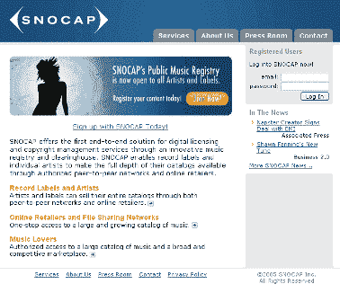
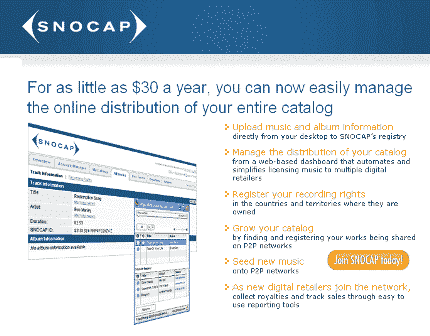
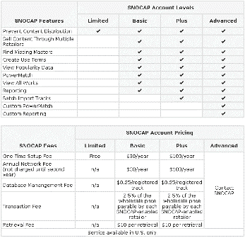

# SNOCAP 简介| TechCrunch

> 原文：<https://web.archive.org/web/http://www.techcrunch.com:80/2005/06/14/snocap-launches-digital-music-registry/>

公司: [Snocap](https://web.archive.org/web/20230311232552/http://www.snocap.com/)

**地点:** [加州旧金山](https://web.archive.org/web/20230311232552/http://maps.yahoo.com/maps_result?ed=To9AO.p_0TpsH.rLOVsusfRD1U5p2kOVmA--&csz=San+Francisco+CA&country=us) 
**状态:**[2005 年 6 月 13 日开播](https://web.archive.org/web/20230311232552/http://www.snocap.com/press/releases/?id=6)

**成立:**2002 年 9 月

**什么事？**

Snocap 允许那些拥有音乐版权的人将音乐放到 p2p 网络和拥有 DRM 的零售网站上。这意味着，通过 Snocap，音乐理论上可以被控制(收费和限制拷贝),并且仍然可以利用极其流行的 p2p 网站进行分发。它是由最初的 Napster p2p 文件共享网络的创始人[肖恩·范宁](https://web.archive.org/web/20230311232552/http://en.wikipedia.org/wiki/Shawn_Fanning)于 1999 年创立的。

目前销售音乐的商业模式包括 iTunes(按下载付费)和雅虎、Napster 和 Rhapsody 等订阅服务，这些服务允许你以每月 5-20 美元的订阅费收听和下载他们目录中的任何内容。

Snocap 的做法与众不同。它们是分散的，因此不需要或者甚至不提供用于下载音乐的集中服务。相反，他们关注的是平台和与标签的关系。

目前的厂牌合作伙伴包括:环球音乐集团、索尼 BMG 音乐娱乐公司、百代唱片公司、Absolutely Kosher Records、Artemis Records/Sheridan Square ENTERTAINMENT、Digital Musicworks International、IDEA Distributors、I AM Music and Entertainment、Gammon Records、独立在线发行联盟、Kufala、street beat Records/pan disc/Kriztal ENTERTAINMENT、Nacional Records、Nettwerk Records、OM Records/Deep Concentration、One lity、One Little Indian、Psychobaby Reality Entertainment、Ryko Group、Six Degrees、SSDD 和 TVT Records

Snocap 允许唱片公司对音乐收费(snocap 将从唱片公司收取的费用中抽取 0%-2.5%的提成)。他们还对高级账户收费，以增加功能和报告。

**标签服务:**

–允许唱片公司和艺术家个人将点对点网络作为安全可靠的分销渠道。
–一站式获取明确的权利并管理跨零售目的地的在线分销。
—能够通过确定业务规则、设置定价和使用条款来保持对内容的完全控制。
–会计和报告服务
–独立艺术家分发和销售音乐的方式

**P2P 和零售网站服务:**

–满足所有许可需求的集中访问点。
–能够从目前仅在文件共享网络上提供的大量音乐中销售音乐。
—来自直播、混音和绝版作品的增量收入
—通过消除与数千名版权所有者保持关系的需要，降低了成本

**屏幕截图:**

**管理:**

Shawn Fanning——首席战略官
Ali Aydar，首席运营官
Christian Castle——总法律顾问

**投资者:**

罗恩·康韦
[摩根塔勒风投](https://web.archive.org/web/20230311232552/http://www.morgenthaler.com/ventures/)
[Walden VC](https://web.archive.org/web/20230311232552/http://www.waldenvc.com/)
 **相关链接:**

[按](https://web.archive.org/web/20230311232552/http://www.snocap.com/press/)
[媒体报道](https://web.archive.org/web/20230311232552/http://www.snocap.com/press/coverage/)
[business model innovation](https://web.archive.org/web/20230311232552/http://www.martin-koser.de/wp_1/index.php/archive/snocap-takes-another-bite/)
[del . icio . us 标签](https://web.archive.org/web/20230311232552/http://del.icio.us/tag/snocap)
[TechStartups](https://web.archive.org/web/20230311232552/http://techstartups.blogspot.com/2005/06/online-music-firm-snocap-goes-indie.html)