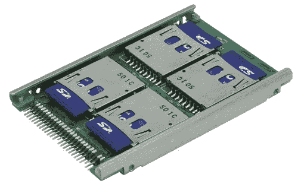

# 所以四张 SD 卡放进了一个驱动器

> 原文：<https://web.archive.org/web/http://techcrunch.com:80/2007/02/19/so-four-sd-cards-walk-into-a-drive/>

# 所以四个 SD 卡进入一个驱动器…

这里有一个看起来很有用的小工具，但是你在当地的电脑上找不到。Century 的 SDB25S 是一个名字很糟糕的外壳，可以插入 IDE 电缆。在盘柜内，您可以插入多达四个 SD 卡(每个最大 2GB ),以使用 SD 卡创建一个单独的驱动器。太糟糕了，它的价格是 260 美元，因为不支持 SDHC，容量上限是 8GB，而且 Windows Vista 也有问题。

[自己打造 2.5 英寸固态硬盘！](https://web.archive.org/web/20201202200448/http://akihabaranews.com/en/news-13309-Create+you+own+2.5%E2%80%9D+SSD+Drive+yourself%21.html)