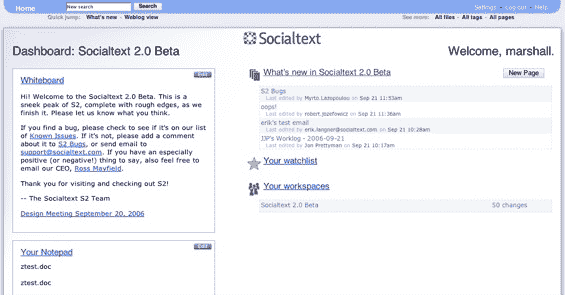

# SocialText 的目标是 wiki 2.0-TechCrunch

> 原文：<https://web.archive.org/web/http://www.techcrunch.com:80/2006/09/21/socialtext-goes-20/>

# SocialText 的目标是维基 2.0

  企业维基供应商 [SocialText](https://web.archive.org/web/20220817192548/http://socialtext.com/) 今天早上推出了其软件的 2.0 版本，并做出了一些对现有客户群以外的人来说很重要的改变。这些变化包括对标准 wiki 接口的彻底检查，以及发布 REST API 以支持与该公司 wiki 的混搭。

SocialText 已经上市四年了。这家拥有 30 名员工的公司拥有 2000 多名客户，并获得了包括 Draper Fisher Jurvetson、SAP Ventures、Omidyar Foundation、Joi Ito 和雷德·霍夫曼在内的全明星阵容的资助。维基百科创始人吉米·威尔斯特、蒂姆·德雷珀、乔伊·伊藤和 SocialText 的罗斯·梅菲尔德组成了该公司的董事会。

这款软件的新版本直面了 SocialText 和 wikis 普遍存在的最大问题；用户界面一直很糟糕。如今，SocialText 增加了许多旨在让非技术用户特别容易采用的功能。

用户登录后将立即看到一个新的控制面板，显示最近的更改、他们的观察列表、来自用户参与的所有工作组的信息以及与同事共享的白板。

整个网站增加了各种导航和排序功能；包括标记的自动建议和突出显示的入站链接。全屏页面编辑是添加到 UI 中的最后一个重要的东西。虽然 WYSIWYG GUI 帮助许多新用户对 wikis 感到更加舒适，但许多 web2.0 工具要求在缩小的文本框内进行编辑，这种需求可以减轻 GUI 的影响。给人们一整页纸来写，他们会觉得自己在 Word 中。

所有这些用户界面的变化可以总结为，SocialText 用户不再需要感到困在 wikispace 中——现在有了熟悉的高级视角，可以与 wiki 功能进行交互。该公司制作了一个很好的展示这些变化的视频。

蜜蜂

关于新的 SocialText 的另一个重大消息是为有兴趣将 SocialText wikis 与其他数据和服务混合的开发人员发布了一个 REST API。这个 API 已经被用来创建一个离线的 SocialText 客户端和至少一个 Google Maps mashup。SocialText 提供 SOAP API 已经有一段时间了。

虽然 API 在消费者维基空间中并不罕见(例如，参见优秀的 [PBWiki](https://web.archive.org/web/20220817192548/http://pbwiki.com/) ，世卫组织[本周刚刚发布了一个 API](https://web.archive.org/web/20220817192548/http://api.pbwiki.com/) )，但 SocialText 的开源企业 API 只是他们对在线社区做出的一长串有价值贡献中最近的一个。从向世界捐赠他们的开源所见即所得工具栏(这是一个从零开始构建的资源密集型项目)，到提供免费托管的维基，再到像玛丽·霍德的[演讲者维基](https://web.archive.org/web/20220817192548/https://www.socialtext.net/speakers/index.cgi)(会议组织者参考的技术演讲者名单，许多女性)这样的重要项目，SocialText 有着真实行动的历史，体现了“给予更多/获得更多”的道德观。

虽然有很多企业维基可用，但 Mayfield 告诉我，随着微软和 IBM 大量进入市场，他预计明年对维基的需求将会激增。一旦 wiki 风格的在线协作变得更加普遍，Mayfield 相信 SocialText 对 wiki 的独家关注、在该领域的四年经验、开源技术和直截了当的定价结构将继续使他们在竞争中脱颖而出。除此之外，该公司现在还可以通过 REST API 增加易用性，并有望增加一个多样化的外部混搭生态系统。

其他公司不会停滞不前，可怕的维基用户界面的现状不可能持续下去，但 SocialText 已经奠定了四年的开源根基，竞争对手很难挖掘出来。

