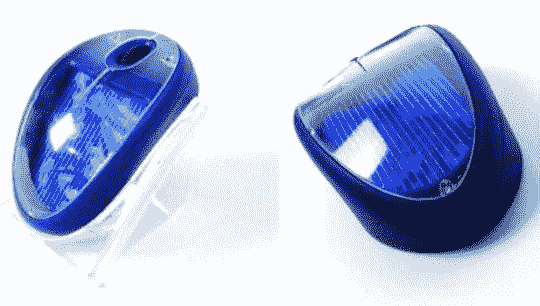

# 唯一的 Mio，没有充值-O 

> 原文：<https://web.archive.org/web/http://techcrunch.com/2007/08/07/sole-mio-no-recharge-o/>

Sole Mio 是荷兰科学研究组织目前正在研发的太阳能无线鼠标。我不知道它是蓝牙还是射频(也许他们还没有到那一步)，但当你使用它时，它使用大约 20mA 的电力，充满电后它可以保持 300mAh。

我喜欢太阳能鼠标的想法，但它必须工作。总有一天，我会使用舒适的有线鼠标，而不是廉价的无线/太阳能/其他鼠标。乍一看，这个鼠标看起来很便宜，但它仍然是一个原型，所以我将保留判断，直到它可用。

你最好坐在窗边(像我一样！)不然就倒霉了。如果荷兰人能够让这项技术工作得足够好，并授权给其他设备，你非常舒适的有线鼠标可能会在不久的将来作为太阳能版提供。

Sole Mio mouse mouse loves 爱太阳【UberGizmo】via[Gizmodo](https://web.archive.org/web/20150919123236/http://www.ubergizmo.com/15/archives/2007/08/sole_mio_mouse_loves_the_sun.html)via[TU Delft](https://web.archive.org/web/20150919123236/http://www.tudelft.nl/live/pagina.jsp?id=e8c72be6-3452-4f04-b1ae-6d6b71f2b88d&lang=en)via[OhGizmo！](https://web.archive.org/web/20150919123236/http://www.ohgizmo.com/2007/08/06/solar-powered-wireless-mouse/)通过 [Core77](https://web.archive.org/web/20150919123236/http://www.core77.com/blog/technology/first_solarpowered_mouse_tested_by_dutch_minister_7032.asp)