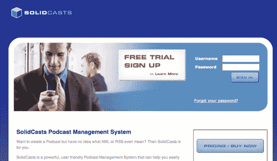

# SolidSpace 提供非常简单的播客服务| TechCrunch

> 原文：<https://web.archive.org/web/http://www.techcrunch.com:80/2006/06/19/solidspace-offers-very-simple-podcasting-service/>

 
北卡罗来纳州 [SolidSpace Llc。](https://web.archive.org/web/20151002011708/http://www.solidspace.com/)将于明天在新加坡举行的[communi sia](https://web.archive.org/web/20151002011708/http://www.communicasia.com/)大会上推出一项名为 [SolidCasts](https://web.archive.org/web/20151002011708/http://www.solidcasts.com/) 的新播客托管服务。铁杆 Web2.0 用户可能不会觉得 SolidCast 界面令人兴奋，但这是一个工具，可以大大简化组织的播客。一直有人问我开始播客最简单的方法是什么，这看起来不错。

SolidSpace 提供各种企业网络应用。公司首席执行官是一位名叫 James H. Capps III 的 IT 经理，副总裁 Andrea Rice 拥有国际营销和商业背景。当地风险投资公司 [Silk Road Equities](https://web.archive.org/web/20151002011708/http://www.silkroadequity.com/) 是他们的主要投资者。

没有花里胡哨，SolidSpace 的产品结合了简单的上传和下载跟踪、RSS 和 iTunes feeds 以及简单的使用说明。该界面有英语或西班牙语版本。

该公司的旗舰 alpha 测试客户是 [HOOAH！！！Radio](https://web.archive.org/web/20151002011708/http://www.hooahradio.com/) ，一个面向美国士兵、他们的家人和支持者的在线电台。如果你在寻找美国中部的企业客户，这是一个很好的目标人群。广播电台是 SolidSpace 通过其播客服务追求的另一个关键市场，例如参见弗吉尼亚本地广播电台 [Z104](https://web.archive.org/web/20151002011708/http://www.z104.com/listingsEntryHeadline.asp?ID=423655&PT=) 。

一个 [SolidCast](https://web.archive.org/web/20151002011708/http://www.solidcasts.com/) 帐户可以免费获得高达 100mb 的存储空间，标准计划是 12.95 美元的 1 GB 播客存储空间(5 GB 每月传输)，高级计划是 19.95 美元的 2 GB 存储空间(10 GB 每月传输)。这是有竞争力的定价。

该公司今天告诉我，联合品牌的 feed URLs(而不是你的 feed 的 SolidCast URLs)和其他功能正在开发中——但大多数开发过程都是为了简化服务。我认为这是一个很好的举措，当我开始在网上看到“由 SolidCast 驱动”的字眼时，我不会感到惊讶。

