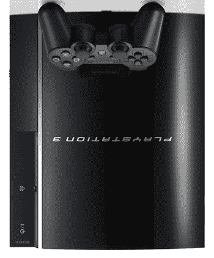

# 一些零售商停止销售 20GB PS3 

> 原文：<https://web.archive.org/web/http://techcrunch.com/2007/04/10/some-retailers-stop-carrying-20gb-ps3/>

索尼抓不住一个突破口。现在看起来该公司本身和几家零售店已经停止销售 20GB 版本的 PS3。索尼自己的 [SonyStyle](https://web.archive.org/web/20140315191438/http://www.sonystyle.com/is-bin/INTERSHOP.enfinity/eCS/Store/en/-/USD/SY_BrowseCatalog-Start?CategoryName=tvvideo_hav_ps3&Dept=tvvideo) 网上商店(注:多么糟糕的网上商店名称——Sony style！呸。)而像 [EB Games](https://web.archive.org/web/20140315191438/http://www.ebgames.com/productmerch.asp?groupid=635) 和 [Best Buy](https://web.archive.org/web/20140315191438/http://www.bestbuy.com/site/olspage.jsp?id=pcmcat104100050000&type=category) 这样的零售商现在只提供更贵(也更赚钱)的 60GB PS3。索尼表示，这是因为消费者对 60GB 版本的需求很高，而不是对 20GB 版本缺乏信心。(别忘了 PS3 在欧洲的发布甚至没有提供 20GB 的型号。)当然，索尼，我相信你。而 rootkits 是无害的。

一些零售商——比如亚马逊——仍然有一些 20g 的库存，所以如果你想要的话就去买吧。否则，准备好再花 100 美元购买[有史以来最好的控制台](https://web.archive.org/web/20140315191438/http://crunchgear.com/2007/03/23/see-i-told-you-the-ps3-is-the-best-console-ever/)。(Upside PS3 为了编辑效果。)

[美国零售商降价 20GB PS3](https://web.archive.org/web/20140315191438/http://www.gamesindustry.biz/content_page.php?aid=24078)