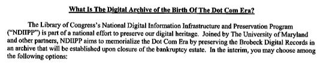

# 有人需要阻止这一切

> 原文：<https://web.archive.org/web/http://www.techcrunch.com:80/2006/12/22/somebody-needs-to-stop-this>

在第一次互联网热潮期间，布罗贝克·普莱格·哈里森·LLP 律师事务所是硅谷一家著名的律师事务所。他们有数以千计的初创公司和上市公司客户，处理他们法律需求的方方面面。他们的客户名单包括思科。不过，这些最终都不重要了——这家律师事务所在 2003 年解散，原因是经济低迷后的财务管理不善。

但现在，布罗贝克的前客户们可能要开始噩梦了。在一个离奇的故事中，处理布罗贝克案件的破产法院援引这些记录的历史价值，已经允许将所有机密的客户文件移交给国会图书馆，并在一个新的公共档案馆展出。该项目甚至有自己的网站，并将在《华尔街日报》和《旧金山纪事报》上刊登广告。

法院正在向前客户发送通知，要求他们选择加入或退出该过程([通知副本在此](https://web.archive.org/web/20220629110824/http://www.mytruston.com/files/brobeck_letter_records.pdf))。如果客户端不可访问，文档将包含在新的归档中。与未选择加入的客户相关的文件将仅在封闭的存档中提供，公众只能有限地访问(参见更多[此处](https://web.archive.org/web/20220629110824/http://brobeckclosedarchive.org/court_docs/Montali%20-%20Signed%20Order%20-%20Aug%20-%202006.pdf))。

这是我最近见过的最愚蠢的事情之一。首先，这些文件仍然是客户的财产，而不是律师事务所或其他任何人的财产。法院完全无视这些权利。这些文件中的许多还将包含非 Brobeck 客户的第三方的极度机密信息，因此不会引起注意。

如果你与 Brobeck 代表的初创公司发生了个人纠纷，你现在可能需要聘请一名律师来保护你的权利。与雇佣关系相关的文件应该被清除，但考虑到要整理的材料数量巨大，事情很可能会被忽略。我保证记者们会迫不及待地尽快挖掘这些文件。

这太荒谬了。谢谢汤姆的提示。