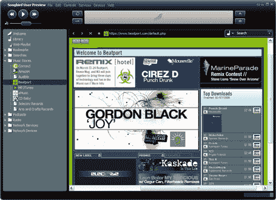
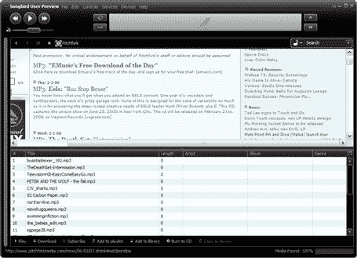

# 鸣鸟今晚发布

> 原文：<https://web.archive.org/web/http://www.techcrunch.com:80/2006/02/07/songbird-to-launch-tonight/>

  Mac 和 linux 会随后推出。

独家截图如下。

因为 songbird 除了是一个媒体播放器之外还是一个网络浏览器，用户将能够浏览网站。如果音频文件嵌入在网站中，它们将单独显示，可以播放、下载、包含在播放列表中等。

> 鸣鸟玩网络。Songbird 可能将网页视为 MP3 的播放列表。很快，网页作者可能会发布播放列表，并将 MP3 转换成 Songbird，以支持像 eMusic 这样的数字音乐商店，以及像 Yahoo！音乐无限，虚拟干扰服务如 Ninjam，播放列表共享服务如 WebJay 等等

因为 Songbird 是建立在 Mozilla 平台上的，所以它可以被第三方完全扩展，只需要很少的开发技能——XML、CSS 和 Javascript。扩展可以在所有平台上运行——windows、mac 和 linux。Songbird 也是开源的，开发者可以修改源代码。

最初支持的格式包括 MP3、AAC、WMA、OGG、FLAC 等。

