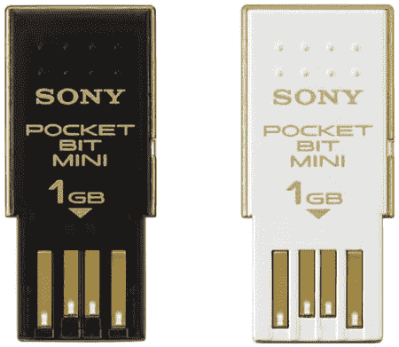
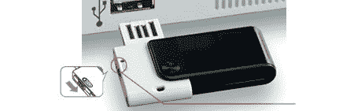

# 索尼宣布推出黄金装饰袖珍迷你 USB 驱动器

> 原文：<https://web.archive.org/web/http://techcrunch.com/2007/08/01/sony-announces-gold-trimmed-pocket-bit-mini-usb-drives/>

索尼公司宣布了阿朵的 Vista ReadyBoost 袖珍位迷你 USB 驱动器。USM-HX 系列有 1gb 和 2GB 容量的白色或黑色可选。索尼试图用它的金色装饰来吸引富人，但是我们这些富人都忙于吸食可卡因，撞毁汽车，并把他们所有的缺点都归咎于另一个孩子。这些驱动器配备了文件编码软件、虚拟扩展器软件和一个秘密锁定文件。这些硬盘与 Windows 和 MAC 兼容，并配有一个双向便携包。这两款硬盘将于 9 月上市，售价分别为 34 美元(1GB)和 52 美元(2GB)。

[索尼 2GB USM-HX 袖珍迷你 u 盘](https://web.archive.org/web/20150921070655/http://www.fareastgizmos.com/computing/sony_2gb_usmhx_pocket_bit_mini_usb_drive.php)【远东小发明】