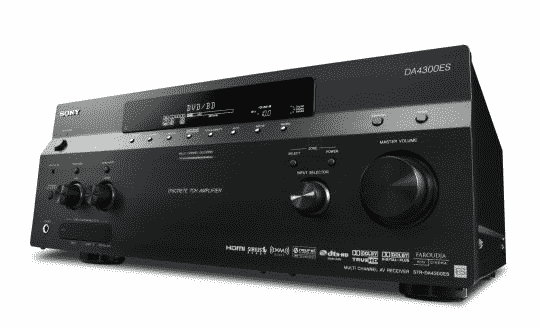

# 索尼宣布推出三款高端接收机

> 原文：<https://web.archive.org/web/http://techcrunch.com:80/2007/07/24/sony-announces-three-premium-receivers/>

索尼今天将推出三款 A/V 接收器，作为其高端设备“提升标准”(ES)系列的一部分。

这三种型号都具有 iPod 集成和索尼的数字媒体端口，允许添加可选配件，如蓝牙接收器、Wi-Fi 适配器或音频基座，以与索尼的网络 Walkman 系列配合使用。

蓝光兼容，接收器能够处理来自其他来源的 1080/60p 和 24p 视频。他们还可以使用 HDMI 连接将非高清内容升级到 1080p。

STR-DA3300ES 将于 8 月上市，售价 1000 美元，STR-DA5300ES 将于 9 月上市，售价 1700 美元，STR-DA4300ES 将于 10 月上市，售价 1300 美元。

[索尼用新的 ES 接收器提升家庭影院的标准](https://web.archive.org/web/20160206191713/http://news.sel.sony.com/en/press_room/consumer/home_audio_video/es_products/release/30881.html)【索尼新闻稿】