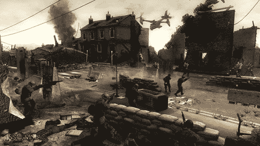

# 索尼“毫无保留地”为英国国教抵抗运动的不幸事件道歉

> 原文：<https://web.archive.org/web/http://techcrunch.com/2007/07/06/sony-apologizes-unreservedly-for-chuch-of-enlgand-resistance-mishap/>

# 索尼为英格兰教会抵抗运动的不幸事件“毫无保留地”道歉

当我读到索尼因为*抵制*而陷入[与英国教会](https://web.archive.org/web/20130628191618/http://crunchgear.com/2007/06/11/resistance-not-so-futile-to-the-church-of-england/)的混战时，我摇了摇头，就像一个失望的父母看到他唯一的儿子连续第五次出局。当然，我想，他们必须道歉，不管这个违规看起来有多小。他们做到了。有了这些话，索尼将希望它最近的公关灾难会迅速而平静地消失:

> ……我们想毫无保留地为造成的冒犯向他们道歉，并向我们可能也冒犯了的社会各界道歉

如果有什么教训要吸取的话，那就是你可能不应该把你的电子游戏设定在真实世界的礼拜场所。我想我得把那个关于一个流氓外星人强行占领圣彼得教堂的想法搁置起来了。

[索尼在视频游戏中道歉](https://web.archive.org/web/20130628191618/http://www.thesun.co.uk/article/0,,2-2007310241,00.html)【太阳】