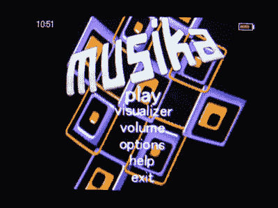

# 索尼 BMG 首款 iPod 游戏:Musika 

> 原文：<https://web.archive.org/web/http://techcrunch.com:80/2007/08/07/sony-bmgs-first-ipod-game-musika/>

哈哈，每次索尼发布与 iPod 相关的东西，它都会提醒自己*真的*在数字音乐方面犯了错误。今天的“可怜的索尼”时刻以一个名为 Musika 的 iPod 可视化工具/游戏的形式来到我们面前，这是索尼 BMG 公司为 iPod 开发的第一个这样的应用程序。Musika 是由给我们带来说唱歌手*PaRappa*的同一个人设计的，是部分可视化的。部分游戏。我不知道它是如何工作的，但我会假定它是无辜的，因为就在不久前, *PaRappa* 还是一个真正有趣的游戏。如果你能拿出 5 美元，那你就去看看。如果它有像*Lumines*(…[和 shinin ' shining '](https://web.archive.org/web/20160422064029/http://youtube.com/watch?v=LHssppekuSo)…)这样的东西的十分之一有趣，我可能会这么做。

尽管正如一位聪明的 iLounge 读者所指出的，要警惕 rootkits。

[Musika (iTunes 链接)](https://web.archive.org/web/20160422064029/http://phobos.apple.com/WebObjects/MZStore.woa/wa/viewGame?id=260035515&s=143441)【索尼 BMG via [iLounge](https://web.archive.org/web/20160422064029/http://www.ilounge.com/index.php/ipod/review/sony-bmg-musika-interactive-visualizer/)