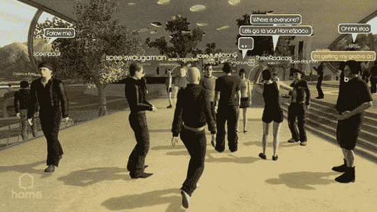

# 索尼考虑将 PSP 带回家

> 原文：<https://web.archive.org/web/http://techcrunch.com/2007/08/07/sony-contemplates-bringing-home-to-psp/>

# 索尼考虑将 PSP 带回家

[Home](https://web.archive.org/web/20130628205520/http://crunchgear.com/2007/03/07/playstation-home-video-teaser/) ，索尼非官方 *Second Life* 实现将于今年秋天登陆 [PS3](https://web.archive.org/web/20130628205520/http://crunchgear.com/category/playstation-3/) ，也可能以某种形式登陆 [PSP](https://web.archive.org/web/20130628205520/http://crunchgear.com/category/gear/psp/) 。也许吧。这是一位营销主管对调查性新闻的堡垒 MTV 说的。营销人员告诉 MTV，

> 直觉上，如果你带着 PSP，你会想带一些回家……”

因此，从这里我们可以推断，索尼希望你在舒适的家中和公共场合携带 PSP 时看起来像一个工具。

同样值得注意的是，纽约是拥有最多 PSP 的城市，索尼曾考虑在其重新设计的 PSP 中添加第二个模拟棒，但在仔细的成本效益分析后放弃了这个想法。

[索尼高管谈论新 PSP 的升级、GPS 附件、纽约吸引力和更多](https://web.archive.org/web/20130628205520/http://www.mtv.com/news/articles/1566451/20070806/index.jhtml)【MTV via[下一代](https://web.archive.org/web/20130628205520/http://www.next-gen.biz/index.php?option=com_content&task=view&id=6728&Itemid=9)】