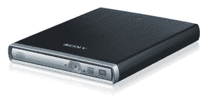
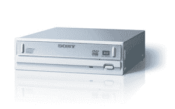
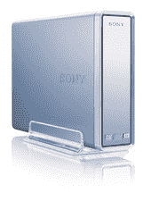

# 索尼推出三款下一代双格式 DVD/CD 可录驱动器

> 原文：<https://web.archive.org/web/http://techcrunch.com/2007/08/07/sony-drops-three-next-gen-dual-format-dvdcd-recordable-drives/>

尽管今天早些时候苹果大肆宣传，索尼设法推出了三款超高速 DVD/CD 驱动器。DRU-840A、DRX-840U 和 DRX-S70U 当然不会让你成为街谈巷议的话题，但它们确实拥有业内最快的记录速度。

这两款 840 多格式 DVD 驱动器都支持 20 倍 DVD R 刻录速度，在标准 16 倍 DVD+R 光盘上刻录 4.7GB 的内容大约需要 5 分钟。那不算太寒酸吧？如果这还不能打动你，那么以 12 倍的速度将 8.5GB 刻录到双层 DVD+R 和 4.7GB DVD+RW 光盘上如何？内置 840A 和外置 840U 驱动器预装了 Nero 7 Express DVD/CD 软件。

DRU-840A

这两种型号都支持用于备份目的的 20X DVD R、12X DVD R DL、12X DVD+RW、6X DVD-RW 和 12X DVD-RAM，以及 48X CD-R 和 32X CD-RW 刻录速度。咻，那是满满一嘴。

DRX-840U

外置 DRX-S70U 刻录机小巧、不显眼，支持 8 倍 DVD R、4 倍 DVD R DL、8 倍 DVD+RW、6 倍 DVD-RW、5X DVD-RAM 和 24 倍 CD-R/RW 刻录速度。两个外部驱动器都由 USB 供电。DRU-840A 现在售价 70 美元。DRX-840U 将于下月上市，售价 110 美元，DRX-S70U 也将于下月上市，售价 130 美元。

[新闻稿](https://web.archive.org/web/20150921064315/http://news.sel.sony.com/en/press_room/consumer/computer_peripheral/dvd_cd_burners/release/30988.html)