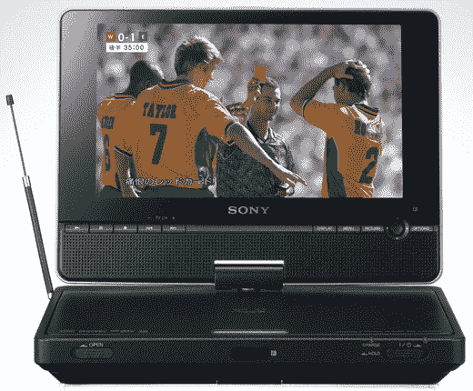

# 索尼 DVP-FX860DT 便携式 DVD 播放器

> 原文：<https://web.archive.org/web/http://techcrunch.com/2007/07/25/sony-dvp-fx860dt-portable-dvd-player/>

# 索尼 DVP-FX860DT 便携式 DVD 播放器

索尼有一个新的便携式 DVD 播放器，对不对，叫做 DVP-FX860DT。嗯，它不是*叫*DVP-FX 860 dt，但这是型号。她是标准配置，分辨率为 800×480，8 英寸显示屏，支持 MP3，还有一个电视调谐器。我要说 500 美元对于便携式 DVD 播放器来说太贵了。

威尔士？有人知道这是什么队伍吗？

[产品信息](https://web.archive.org/web/20130628173452/http://www.sony.jp/CorporateCruise/Press/200707/07-0725/)【索尼 via [新发布](https://web.archive.org/web/20130628173452/http://www.newlaunches.com/archives/sony_dvpfx860dt_portable_dvd_player.php)】