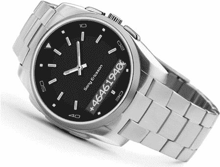
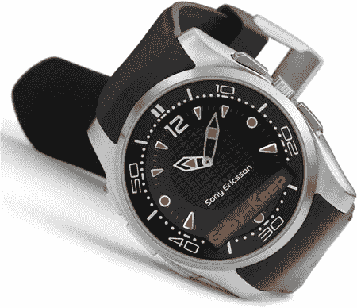
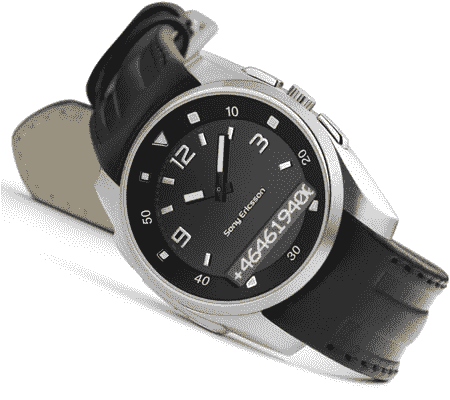

# 索尼爱立信蓝牙手表，第二轮| TechCrunch

> 原文：<https://web.archive.org/web/http://techcrunch.com:80/2007/06/15/sony-ericsson-bluetooth-watches-round-two/>

 
专业

在我最喜欢的[手表评论网站写这些索尼爱立信蓝牙手表之前，我感觉很糟糕，但就这样吧。大 SE 有三种新车型可供选择，音乐、行政和经典，它们都是 MBW-150 车型系列的一部分。正如你可能猜测的那样，这些手表与 se 蓝牙手机兼容。配对后，手表会在正面显示来电号码。在那里，你可以选择忽略来电，直接转到语音信箱或接听。](https://web.archive.org/web/20160513001827/http://wristwatchreview.com/)

 
音乐

 
经典 < /

除此之外没有太多，但是如果你曾经在一个大城市漫步过，你就会知道听到你的手机铃声或者感觉到它振动是多么困难。因此，除了看起来相当锋利，如果不是有点笨重，它背后实际上有一些实用性。

这些手表计划在北美首次亮相。

[新闻稿【Fareastgizmos.com](https://web.archive.org/web/20160513001827/http://www.sonyericsson.com/spg.jsp?cc=us&lc=en&ver=4000&template=pc3_1_1&zone=pc&lm=pc3&prid=8107)索尼爱立信