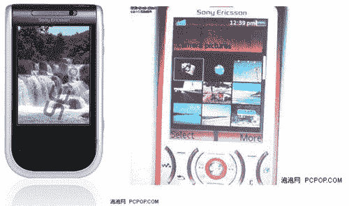

# 索尼爱立信的触摸屏智能手机:什么，苹果担心？

> 原文：<https://web.archive.org/web/http://techcrunch.com/2007/03/09/sony-ericssons-touchscreen-smartphone-what-apple-worry/>

索尼爱立信将推出自己的触摸屏智能手机，标志着继苹果两个月前在 T2 举办的大规模活动后，又一款此类设备的进入。现在，这些“信息”的来源是一些见不得光的中文网站，这意味着我们必须依靠机器翻译来破译信息，而不是说有任何信息。只是一些模糊的手机照片，可能会出现也可能不会出现。完美。

[SPM 新手机永远不够用，两部新曝光【PCPop.com via](https://web.archive.org/web/20150919044659/http://www.mad4mobilephones.com/news/620/)[Mad 4 手机](https://web.archive.org/web/20150919044659/http://www.mad4mobilephones.com/news/620/)