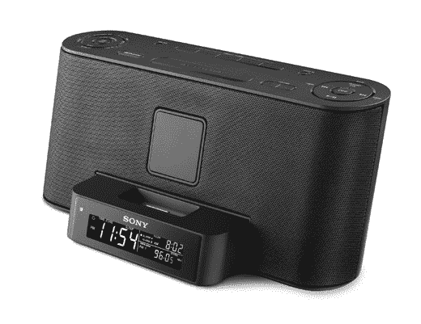

# 索尼 iPod 时钟收音机:没有仇恨，只是一个坚实的实施

> 原文：<https://web.archive.org/web/http://techcrunch.com/2007/07/18/sony-ipod-clock-radio-no-hate-just-a-solid-implementation/>

# 索尼 iPod 时钟收音机:没有仇恨，只是一个坚实的实施

Good ol' Sony 希望你醒来时看到你已经下载的千兆字节和千兆字节的白色标签，以便让你的一天有一个精彩的开始。要做到这一点，你需要它最新的时钟收音机，ICF-C1iP。它应该适合你每天早上 6:30 起床，化妆和做头发，然后出门去敲碎石头的日常生活。这款收音机使用的是你现在应该很熟悉的 iPod 基座适配器，所以它与大多数 iPod 兼容。(希望新的[也是](https://web.archive.org/web/20130628174515/http://crunchgear.com/2007/07/17/crunchrumor-6g-ipod-to-join-iphone-apple-tv-in-featuring-youtube-content/)。)它有所有的标准配件，如无线遥控和自动夏令时设置。这是个收音机，你还能指望什么？

索尼还推出了 iPod 音乐盒 ZS S2iP。你知道该怎么做:插入你的 iPod，或者通过 aux 输入、像样的声音等插入其他音频源。两个都只有 100 美元，下个月就应该到了。我实际上在 CG 聊天室说，“嘿，听起来很不错。”然后我的同事取笑我说了索尼的好话。憎恨者。

[新闻稿](https://web.archive.org/web/20130628174515/http://news.sel.sony.com/en/press_room/consumer/portable_audio/release/30825.html)【索尼】