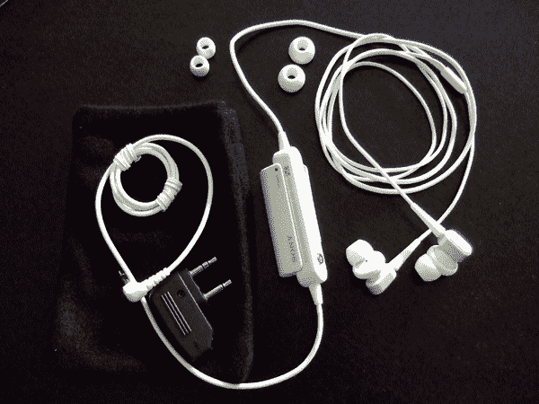
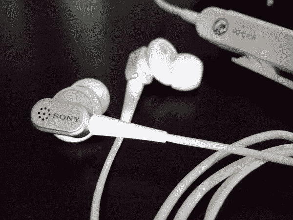
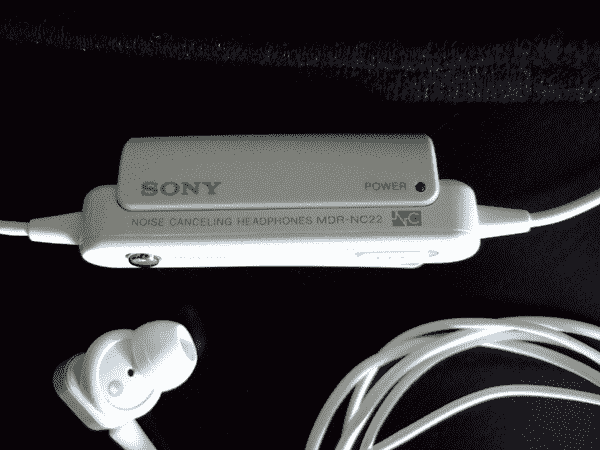

# 索尼 MDR-NC22 降噪耳塞评测

> 原文：<https://web.archive.org/web/http://techcrunch.com:80/2007/05/17/sony-mdr-nc22-noise-cancelling-earbuds-review/>

# 索尼 MDR-NC22 降噪耳塞评论

我最近有机会测试索尼的新降噪耳塞 MDR-NC22。我也请我的兄弟给他们一个尝试，因为他是一个经常飞行的人，并且自 1999 年以来一直使用索尼的第一代 MDR-NC10。他们已经很好地坚持了八年，行驶了 120 万英里。所以对这些新手来说门槛很高。判决结果？太好了！但是有一个严重的破坏因素。请继续阅读，找出原因。

 **合体/完成**

这些索尼在耳塞降噪耳机相对狭小的空间里的玩法。不像 Bose、 [Able Planet](https://web.archive.org/web/20210304203422/http://crunchgear.com/2007/02/27/able-planet-clear-harmony-noise-canceling-headphones-hands-on/) 和 JVC 的那种又大又高的噪音消除器，它们超级小巧，可以放在你的外耳道内。我喜欢轻装旅行，所以这些是我的旅行手机的选择。它们由两个仅比普通耳塞略大的耳塞(考虑到每个耳塞都有一个内置麦克风，这已经很好了)和一个电池供电的控制单元组成，该控制单元进行主动噪声消除处理。这些不同于被动的 Etymotics 和 Shures，它们仅仅依靠紧密的密封来隔绝周围的噪音。

我注意到的第一件事是，这些耳机完成得非常好。它们有三种颜色，黑色、白色和粉色。我收到的审查单位是白色的，有一个很好的乳白色和哑光噪声消除单位完成。控制单元很小，有一个很好的开关、衬衫夹和“监控”按钮。监视器按钮可以让你听到微型麦克风听到的声音(它可以让 iPod 或任何你插入的东西静音)，如果你想，比如说，从空姐那里听到晚餐选择。

**功能**

好，让我们来看看他们是如何表演的。我第一次打开这些的时候，我正坐在机场的休息室里，周围有很多噪音和聊天声。我立刻被打动了。耳塞没有 NC10 的密封好，所以我不认为它们会工作得那么好。我意识到，虽然噪音消除是如此之多的积极比旧的，整体效果要好得多。空气中的嗡嗡声立即消失了，电视和其他喝醉的商务旅客的闲聊声也减少了。我迫不及待地想在空中试一试。

一个小时后，我在机舱内打开它们，我立刻感到失望。嘶嘶声如此之大，我想它们可能有缺陷。我不敢相信我以前没有注意到这一点。当然，噪音消除比 NC10 的更好，但糟糕的密封和响亮的嘶嘶声足以让我在它们永远消失之前再买一套 NC11(更新的 NC10)。也许随着时间的推移，我可以习惯这种嘶嘶声，但我对此表示怀疑。与超安静的老式花蕾相比，这是多么令人失望。

从好的方面来说，音质似乎和 NC10 的一样好(顺便说一句，NC10 的音质非常好。与我的旧 MDR-V6 工作室显示器相当)。monitor 按钮的效果更好，因为声音更好地模拟了您在没有任何耳机的情况下听到的声音，并且不再有任何声音从 iPod 中“流出”(您可以隐约听到 NC10 上按下 monitor 按钮时 iPod 的播放声音)。我真的很欣赏较小的芽和控制盒。索尼在盒子里装了一块 AAA 电池，这一点很好。(还包括一个便携包、3 个不同尺寸的耳塞和 airline seat 双 3.5 毫米插头适配器。)

我无法测试的是电池寿命，但我很确定从规格来看，它们会像 NC10 一样长，NC10 有着惊人的寿命。此外，我认为随着时间的推移，白色的电线会变得很脏，所以我更喜欢黑色的。它们现在仅售 99.99 美元。

[产品页面](https://web.archive.org/web/20210304203422/http://www.sonystyle.com/is-bin/INTERSHOP.enfinity/eCS/Store/en/-/USD/SY_DisplayProductInformation-Start?ProductSKU=MDRNC22/WHI)