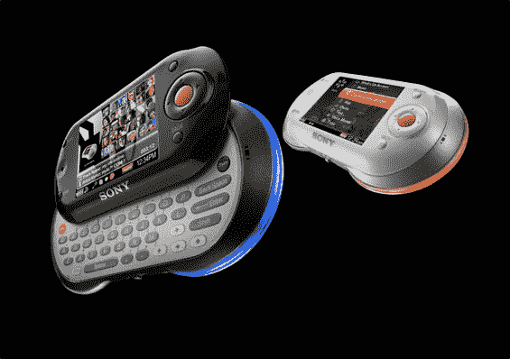

# 与 Skype TechCrunch 打包在一起的索尼 mylo wifi 设备

> 原文：<https://web.archive.org/web/http://www.techcrunch.com:80/2006/08/07/sony-mylo-wifi-device-packaged-with-skype/>

# 与 Skype 打包在一起的索尼 mylo wifi 设备

明天将发布两个相关的重大公告——[mobile runch 获得了](https://web.archive.org/web/20221007020755/http://mobilecrunch.com/2006/08/07/skype-and-sony-team-up-to-deliver-the-mylo-personal-communicator/)的独家新闻。索尼宣布了其新的 [mylo](https://web.archive.org/web/20221007020755/http://www.sony.com/mylo) (“我的在线生活”)个人通信器，一种可以在任何 802.11b 无线网络中工作的 wifi 设备。它允许即时通讯，互联网浏览和电子邮件，以及听音乐(MP3，ATRAC 或 WMA ),查看照片和 MPEG-4 视频。这个东西是支持 Skype 的，Skype 正在单独发布这个功能。

mylo 有一个 2.4 英寸的 LCD 屏幕(对角线测量)，1 GB 的闪存和一个滑出式 qwerty 键盘。你想要什么颜色都可以，只要是黑色或者白色。索尼声称，该电池将允许长达 45 小时的音乐播放或 7 小时的聊天和网上冲浪。

它还预装了 Skype、Google Talk 和 Yahoo Messenger，并包括 JiWire 的 hotspot 目录，其中列出了美国大约 20，000 个 wifi 网络

九月份找，费用是 350 美元。

**这可能是我们一直期待的 Skype wifi 设备。这些东西一发布我就去弄一个，黑色的，我怀疑我会经常用。**

