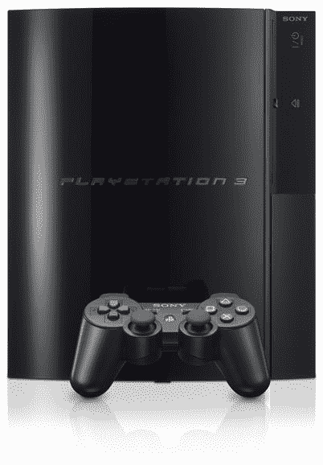

# 索尼定价第一方 PS3 发布游戏

> 原文：<https://web.archive.org/web/http://techcrunch.com:80/2006/10/10/sony-prices-first-party-ps3-launch-games/>

# 索尼定价第一方 PS3 推出游戏

日本博客圈报道称，日本两个第一方 Playstation 3 发布游戏的价格将低于新发布的 Xbox 360 游戏。这些标题将包括《抵抗:人类的堕落》中的*、《失眠者》中的*以及《游戏共和国》中的*源氏*。这些游戏的售价将为 5900 日元(49.50 美元)，因此将比美国的 PS3 游戏更便宜(我们的游戏定价为 59.99 美元)。目前还没有任何关于 Playstation 3 第三方游戏定价的信息，所以目前我们可以假设它们的零售价通常为 6800 日元(58.00 美元)。

Gamasutra 指出，大型游戏和 RPG 在日本通常定价较高。例如，Tecmo 为 Xbox 360 开发的*死亡或活着 Xtreme 2* 目前零售价为 9240 日元(79.00 美元)。79 美元买一个穿着比基尼跑来跑去的电子游戏辣妹？！是啊，我可能也会买。

[索尼定价 PS3 推出游戏](https://web.archive.org/web/20130627211336/http://www.gamasutra.com/php-bin/news_index.php?story=11180)【gamasutra】