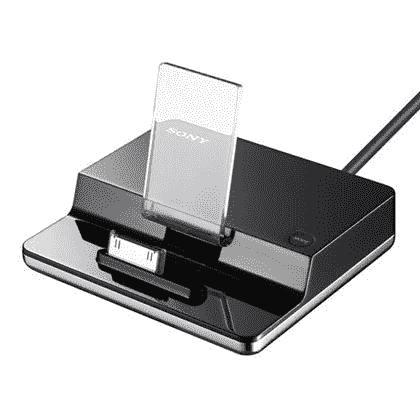

# 索尼准备发布另一款 iPod 基座:DockTDM | TechCrunch

> 原文：<https://web.archive.org/web/http://techcrunch.com/2007/04/03/sony-ready-to-release-another-ipod-dock-the-docktdm/>

# 索尼准备发布另一款 iPod 基座:DockTDM

可怜的索尼、[低迷的 PS3 销售](https://web.archive.org/web/20130628164702/http://crunchgear.com/2007/03/21/wii-sales-destroying-the-ps3s/)以及除了[之外的所有人都被苹果挤出了数字音乐业务的](https://web.archive.org/web/20130628164702/http://crunchgear.com/2007/03/19/sony-talks-about-apple-could-teach-a-weeping-willow-how-to-cry-cry-cry/)。为此，它发布了 100 美元的数字媒体端口 iPod DockTDM-IP1，这是一种与 Bravia 系列家庭影院设备集成的 iPod dock。这里没有太多的操作:只需将 iPod(第四或第五代，mini 或 nano)插入连接器，然后将设备插入 Bravia 的数字媒体端口。然后音乐从你昂贵的 Bravia 系统中响起。可能有点过了，尤其是如果它是低比特率的。(记住，如果你得到了新的和改进的[无 DRM 的](https://web.archive.org/web/20130628164702/http://crunchgear.com/2007/04/02/emi-selling-drm-free-music/)音乐，这不成问题。)

[产品页面](https://web.archive.org/web/20130628164702/http://www.sonystyle.com/is-bin/INTERSHOP.enfinity/eCS/Store/en/-/USD/SY_DisplayProductInformation-Start?ProductSKU=TDMIP1)【索尼 via [iLounge](https://web.archive.org/web/20130628164702/http://ilounge.com/index.php/news/comments/sony-offers-ipod-dock-for-bravia-systems/) 】