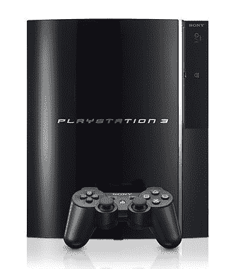

# 索尼拒绝进口 PlayStation 3

> 原文：<https://web.archive.org/web/http://techcrunch.com:80/2006/10/20/sony-says-no-to-importing-playstation-3/>

用阿里 G 的话说就是“什么叫合法？”在索尼与流行的在线零售商 Lik-Sang 的案件中，从日本进口 PS3，PS2 和 PSP 到欧洲不是。法官 Michael Fysh 发现 Lik-Sang 向欧洲销售索尼 PSP 时，销售了属于索尼的知识产权。法院裁决后，索尼公司的一名代表声明:

> 法律是明确的；grey 未经 SCE 的明确许可，向欧盟进口 PS2、PSP 或 PS3 是非法的。因此，我们将利用法律的全部范围来阻止任何选择这样做的零售商。最终，我们试图保护消费者不被出售不符合严格的欧盟或英国消费者安全标准的硬件，由于电压供应差异等；在 PS3 的情况下，不能向后兼容 PS1 或 PS2 软件；不会播放欧洲蓝光电影或 DVDs 不在保修范围内。

到目前为止，索尼只是因为 PSP 的知识产权而打官司，而不是 PS3。但似乎它会竭尽全力阻止 PS3 进口到欧洲，甚至会再次诉诸法律。所有这些都让已经面临 4 个月主机延迟的欧洲游戏玩家更加困难。这也损害了索尼在欧洲的声誉，由于无法兑现在三个市场当天发布的承诺，索尼在欧洲的声誉已经直线下降。先是德国没有《战争机器》,现在欧洲也没有 PS3 进口，看起来游戏产业目前并不适合欧洲。

索尼拒绝进口 Playstation 3