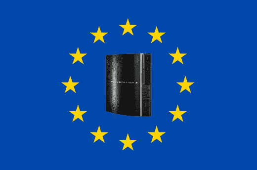

# 索尼在欧洲销售 80 万台 PS3，被誉为成功之作

> 原文：<https://web.archive.org/web/http://techcrunch.com/2007/04/17/sony-sells-800k-ps3s-in-europe-dubbed-a-success/>

# 索尼在欧洲销售 80 万台 PS3，被称为成功

索尼已经在欧洲售出 80 万台[PS3，公司首席执行官霍华德·斯金格称之为“历史上最大的消费电子产品销售”斯特林格先生真谦虚。索尼表示，这一成功(售出 80 万台当然不是什么值得嘲笑的事情，尽管](https://web.archive.org/web/20230322164155/http://crunchgear.com/2007/03/26/microsoft-thinks-its-cool-crashes-ps3-euro-launch/)[任天堂](https://web.archive.org/web/20230322164155/http://crunchgear.com/2007/03/20/nintendo-exec-claims-victory-in-europe/)可能对所有这一切都有话要说)可以归因于欧洲游戏玩家没有日本游戏玩家那样的“感知”这一事实。在我听来，他好像有点讨厌日本。

这次发行见证了 1.99 亿美元的转手。太糟糕了，在上帝之国的发射并不顺利。

Stringer 说，在欧洲售出了近 80 万台 PS3