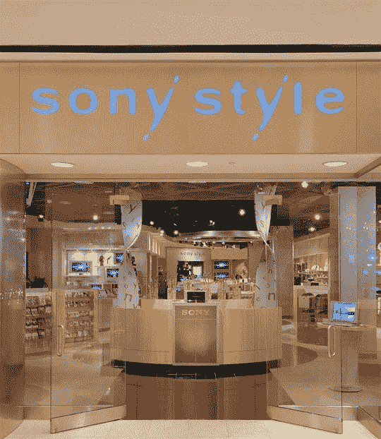

# 索尼将提供店内技术支持

> 原文：<https://web.archive.org/web/http://techcrunch.com/2007/06/26/sony-to-offer-in-store-tech-support/>

下一次你在当地商场的索尼风格商店闲逛时，你可能会发现人们在排队购买 PS3、VAIOs 和随身听。不要惊慌，因为他们只是在尝试索尼新的店内技术支持服务。这项服务被称为“后台”，将在纽约和新泽西州的索尼风格商店提供，当然类似于苹果的天才吧设置。如果设备出现问题，索尼电子产品的所有者可以上门维修、更换或诊断。

VAIO 的所有者将能够从在后台工作的员工那里获得数据传输、升级、电脑购买建议等等。甚至你的过保修期的迷你光盘播放器也可以有偿维修。索尼表示，到 2007 年底，15 家商店将为顾客准备好后台。

[索尼跟随苹果，提供店内支持](https://web.archive.org/web/20160913210114/http://www.electronista.com/articles/07/06/26/sony.backstage/)