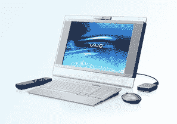

# 索尼推出 VAIO LS1 电视/电脑组合

> 原文：<https://web.archive.org/web/http://techcrunch.com/2006/08/22/sony-unveils-vaio-ls1-tvpc-combo/>

# 索尼推出 VAIO LS1 电视/电脑组合

随着越来越多的组合机，索尼推出了最新的合并，VAIO LS1 电视/电脑。该装备采用 iMac 风格，底盘内置在 19 英寸 WSXGA+显示器的背面。

它由英特尔酷睿双核处理器、2GB 内存、250GB 硬盘和集成的 802.11 b/g 驱动。附带的无线鼠标和键盘显然可以在不使用时折叠到系统中，以保持整洁的外观。

该设备配有 Windows Media Center 2005 和 NTSC 电视调谐器，因此该系统可用作 DVR。用户可以用附带的 DVD 刻录机备份他们的录像。LS1 将于 9 月中旬上市，售价约为 2100 美元。

[索尼将高品质的液晶电视与台式电脑融合为一个时尚的组合](https://web.archive.org/web/20201129135654/http://news.sel.sony.com/en/press_room/consumer/computer_peripheral/desktops/release/24184.html)