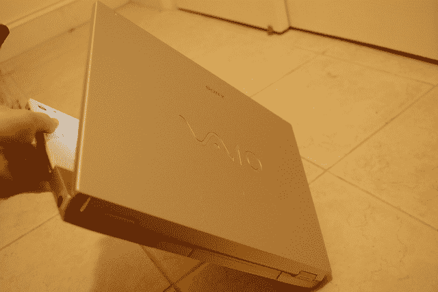

# 索尼 VAIO FZ180 笔记本电脑评论

> 原文：<https://web.archive.org/web/http://techcrunch.com/2007/07/10/sony-vaio-fz180-laptop-review/>

过去几周，我一直在玩索尼新款 Vista 驱动的 Vaio FZ180 笔记本电脑。它很薄，白色，装有蓝光驱动器，但你应该花 2000 美元买它吗？跳完之后全复习

有一点是肯定的:这台电脑看起来很棒。键盘上方的金属外壳和格栅扬声器面板给了它一个伟大的工业外观(想想布什维克阁楼，或墨西哥卷饼店的内部)。白色外壳闪闪发光。如果 Thinkpad 的四四方方的设计让你反感，你也不想效仿 iPack，这款可能会吸引你。它有 1.4 英寸厚——不算厌食症，但考虑到里面的东西，已经足够苗条了。

在大多数情况下，处理器会弹出。它由英特尔 2 GHz Core 2 Duo t 7300 处理器提供支持，这是您真正想要的。尽管如此，有时打开新的应用程序或窗口会导致一些令人惊讶的延迟。当然，Vista 很可能是罪魁祸首，所以我们让索尼喘口气。

本质上，FZ180 是一台媒体机器。屏幕非常明亮——色彩鲜明，即使只有 15 英寸，它也能真正展示蓝光驱动器。显然，他们用了一点 Bravia 的魔力来让屏幕发光，使用了与大电视相同的底层技术来提高对比度和色彩。我还没有打开箱子看看这到底需要什么(他们称之为“Xbrite”技术)，但我知道屏幕不会让任何人抱怨。考虑到我们每天有多少时间花在盯着电脑显示器上，这是一件非常好的事情。而且 NVidia GeForce 8400 GT 显卡不疼。

因为这是一台媒体机器，所以他们安装了一个相当大的硬盘(至少对于笔记本电脑来说是这样)。)它的 200 GB 应该能让大部分人开心。

然而，有一件事让我印象深刻:电脑上有一个大大的金色贴纸，让我知道你正在处理“全高清 1080”呃。不完全是。实际的原生分辨率为 1，280×800，对于 15 英寸的屏幕来说这很好，但真的会让你想知道索尼在想什么。我想，如果你把它 HDMI 到你的 Bravia，你会处理“全高清 1080”，但坐在你的桌子上，你看到的可能更好地描述为“不完全全高清 800”。"

至于声音，格栅扬声器输出的音频比大多数笔记本电脑都更清晰、更响亮(它淹没了我的 MacBook 微弱的最大音量)，尽管低音还有待改进(笔记本电脑通常都是这样)。)在扬声器旁边，专用的媒体控制确保改变音量或停止播放电影不会超过一秒钟。

当然，投资一台蓝光机器并把它限制在笔记本电脑大小的屏幕上(不管它有多亮)将是一种耻辱。令人欣慰的是，这台机器的侧面增加了足够的输出，大多数买家应该有足够的硬件将视频传输到投影仪或电视上。它有 HDMI(这样你就不会浪费蓝光)、S-Video、VGA-out，还有一个聪明的举动，在外壳的两侧都有 USB 孔(你有多少次不得不把一根线拧成一根笨拙的意大利面条线来达到想要的输出？)

如今，索尼似乎已经做了长远的打算，并齐心协力让他们的机器经得起未来的考验。这款手机配有 802.11n Wi-Fi，所以如果你是购买最新无线路由器的三个人之一，你就可以使用它了。

有一件事可能会成为热敏者的绊脚石:这台电脑会变热。就像:感觉你拿着一个直发器。我们真的不得不把这个东西放在一边几个小时，因为我们害怕烤我们的大腿或电脑的内脏。

然后是电池寿命，简单来说就是“嗯”这东西正常使用不到两个小时就坏了。如果你要飞越大西洋(或者甚至飞往芝加哥)，你可能需要带上第二块电池，以免在飞机上观看他们播放的任何淡化的家庭友好型电影。

然而，最令人头疼的是下载的视频文件播放速度有多慢。这可能是因为电脑只是加载了大量消耗资源的垃圾软件(的确如此——啊),或者是我们审查部门特有的东西，但尝试在 Windows Media Player 中播放视频文件令人沮丧——它们比我 3 年前的戴尔台式机上的类似文件断断续续。为了了解情况，我们查看了 Vista 内置的 Windows 体验指数基准测试工具的性能得分。在大多数类别中——处理器、内存、主硬盘——它~~让~~眼花缭乱，已经足够好了(在 ~~5 分~~ 5.9 分中，它们的得分分别是 4.9 分、4.8 分和 4.8 分)。然而，在图形方面，分数如此之低，以至于我倾向于认为我们被派去的审查单位有问题。在图形和游戏图形部分，它得到了 1.0 分 ~~5~~ 5.9 分。这是绝对最低的分数，也是一个真正令人挠头的分数。

底线是:这是一台媒体机器。如果你是那种想建立一个像样的蓝光图书馆的人，也需要一台 Vista 驱动的笔记本电脑，这可能适合你。到目前为止，在这个价格范围内，没有多少外观漂亮、性能良好、以媒体为中心的 Vista 笔记本电脑。售价 2000 美元，不会让你倾家荡产，但你最好确定你想要那台蓝光光驱(索尼(Sony)卖的一台类似的没有蓝光的机器，价格便宜 500 美元。)不过，最好在百思买(Best Buy)的显示器上查看一下基准测试，以获得第二种意见——我们的得分如此之低，以至于我们姑且假定索尼是侥幸成功。