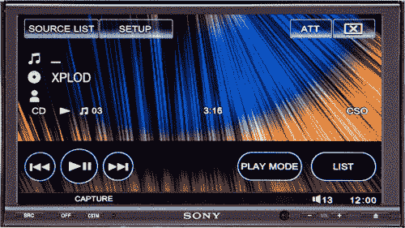

# 索尼的 XAV-W1 SACD 播放器:车载 5.1 音效

> 原文：<https://web.archive.org/web/http://techcrunch.com/2007/07/30/sonys-xav-w1-sacd-player-in-car-51-sound/>

在发烧友势利者的利基市场之外，超级音频 CD 相对来说并不出名。尽管很少有人知道这种格式，积极使用它的人就更少了，但索尼将推出 XAV-W1，这是它有史以来第一款车载 SACD 播放器！它完全兼容 5.1 音响系统，拥有 7.1 英寸的 WVGA 屏幕，并通过与卫星广播、高清广播和 iPod 控制的兼容性进一步经得起未来的考验。你可以在 7.1 英寸的屏幕上观看电影，所以不要认为它只是为了展示。

像大多数售后收音机一样，XAV-W1 支持 MP3 和 WMA 文件。然而，与大多数售后市场玩家不同的是，这款产品有点贵，8 月份上市时零售价为 800 美元。索尼是怎么了，它的产品要价奇高？我绝不会花 600 美元来玩 FPS，也绝不会为了听相当有限的 SACD 目录而多花 200 美元。

[新闻稿](https://web.archive.org/web/20140122121004/http://news.sel.sony.com/en/press_room/consumer/mobile_entertainment/receivers/release/30914.html)【索尼 via [秋叶原新闻](https://web.archive.org/web/20140122121004/http://www.akihabaranews.com/en/news-14474-An+SACD+player+for+your+car%2C+by+Sony.html)】