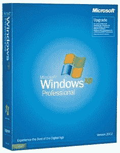

# 抱歉，我们刚刚用完 XP-TechCrunch

> 原文：<https://web.archive.org/web/http://techcrunch.com/2007/04/12/sorry-were-fresh-out-of-xp/>

# 抱歉，我们刚刚用完 XP

看起来个人电脑制造商被微软耍了。根据 Slashdot 的说法，到今年年底，制造商将无法获得 Windows XP OEM 的副本。戴尔将在精选机型上销售 XP，但只持续到年底，因为微软不允许进一步销售。从很多层面来看，这都是微软的一个糟糕举动。首先，消费者想要选择。如果我不想在我的电脑上安装 Vista，我就不应该安装它。此外，XP 将运行您的所有应用程序，文件没有问题，没有故障。

一半为 XP 设计的应用程序仍然不能在 Vista 中运行，Vista 对包括我自己在内的大多数用户来说是一个巨大的痛苦。我明白微软真的想推 Vista，但是在你的 OS 实际工作之前不要这么做。

XP 的末日即将来临