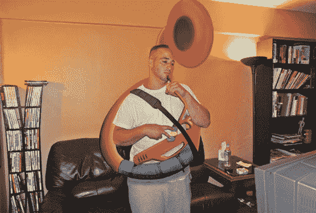

# 动视的失败

> 原文：<https://web.archive.org/web/http://techcrunch.com/2007/08/02/sousaphone-hero-a-flop-for-activision/>

在花费数年时间制作蹩脚游戏后，动视已经遭受了打击，随着*大号英雄*的发布，它的自负再次受到打击。《洋葱报》报道称，“尽管有 19 世纪 90 年代朗朗上口的配乐”，这款游戏仅售出微不足道的 52 份。这款游戏是在*吉他英雄*及其续作*吉他英雄 2* 获得成功后发布的。

为什么没人买这个游戏？你可以选择很酷的大号手，如约克郡公爵和康斯特布尔·特罗布戴默，并在游戏附带的塑料大号控制器上尽情摇滚。也许 345 美元的零售价在游戏失败中起了作用。世人永远不会知道。

[动视报道《大号英雄》销量低迷](https://web.archive.org/web/20151223143155/http://www.theonion.com/content/news/activision_reports_sluggish_sales)【洋葱】