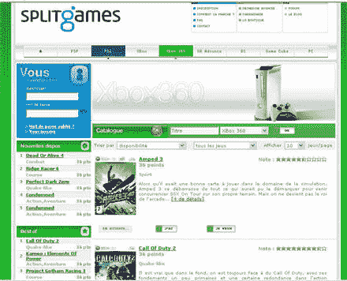

# split games vs swap tree 

> 原文：<https://web.archive.org/web/http://www.techcrunch.com:80/2006/06/05/splitgames-vs-swaptree/>

  继迈克[对 Swaptree](https://web.archive.org/web/20221002135953/http://www.beta.techcrunch.com/2006/06/02/i-like-swaptree-but/) 的分析之后，我将它与 [SplitGames](https://web.archive.org/web/20221002135953/http://www.splitgames.fr/) 进行了比较，后者是一家法国公司，也在产品交易社区的院子里玩游戏，但玩的是不同的游戏规则。在我看来，更相关。这项服务目前只有法语版。

SplitGames 只专注于视频游戏。如果你考虑到一个产品的生命周期(相当短)和新的热门游戏的高价格，这个类别可能是与产品交易最相关的。青少年通常不能每三个月买一个新游戏，但他们真的想玩很多新游戏。

**在 SplitGames 上，你声明你拥有什么，但最重要的是你想要什么**。他们将保证交易，并以安全和简单的方式匹配交易者。每款游戏都有一个基于零售价格、发布日期和网站上游戏供求的积分值。每次你交易一个游戏，你就可以累积点数来购买一个新游戏。机制简单明了。他们绕过了 Swaptree 的纯市场算法。

SplitGames 不是免费的。但另一方面，他们保证了交易系统的运行，使你能够避免坏的意外(交货，游戏选择，安全交易等)。).当然，这种模式对公司也有好处，因为服务的成功将直接推动收入的成功。

但最重要的是，SplitGames 设法在游戏领域建立了一个真正的垂直社区。每个游戏都有他的论坛，可以评分评论。这创造了一种动力，有利于公司最终实现其最终目标:创造游戏交易。

总之，Swaptree 的方法是通用的，基于算法和广告的。SplitGames 是垂直的、优质的和社区驱动的。在我看来，第二种方式更有机会获胜，不仅因为它的商业模式，而且主要是因为用户会觉得他们是一个社区的一部分，在这里他们可以获得他们想要的东西，交易他们不想要的东西。

让我们希望 SplitGames 将很快推出英文版。