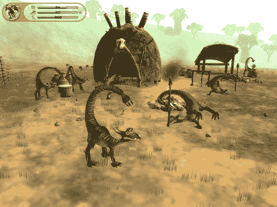

# 孢子没有延迟，仍然在 2008 年春季的轨道上

> 原文：<https://web.archive.org/web/http://techcrunch.com/2007/06/21/spore-not-delayed-still-on-track-for-spring-2008/>

这只是一个大误会，仅此而已。昨天暗示威尔·莱特的*孢子*被砍掉的消息是“误传”的产物艺电公司的一名代表给次世代公司打电话辟谣，称这款游戏目前仍计划在 2008 年 4 月开始的 2009 财年早期上市。那么 08 年春天。为什么公司不能用简单的语言？

EA，几乎没人喜欢你了。因此，扼杀你仅有的游戏之一是愚蠢的——也是威尔·莱特的游戏之一——几乎每个人都想玩。

[EA:孢子延迟“误传”](https://web.archive.org/web/20150909073901/http://www.next-gen.biz/index.php?option=com_content&task=view&id=6083&Itemid=2)【下一代】