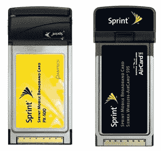

# Sprint 增加了 EV-DO 修订版 A 卡——TechCrunch

> 原文：<https://web.archive.org/web/http://techcrunch.com/2006/09/12/sprint-adds-ev-do-revision-a-cards-2/>

# Sprint 增加了 EV-DO 修订版 A 卡

 Sprint 今天宣布将增加两张新卡，以支持即将推出的 EV-DO 版本 A 升级。新卡是来自 Sierra Wireless 的 Pantech PX-500 和 Aircard 595。这两种卡都支持 450-850 kbps 的速度。PX-500 将以 199.99 美元的价格提供，或者两年期合同免费，而 Aircard 595 的价格为 24.99 美元，或者两年期合同低至 99.99 美元。

[冲刺](https://web.archive.org/web/20201202132139/http://powervision.sprint.com/mobilebroadband/)