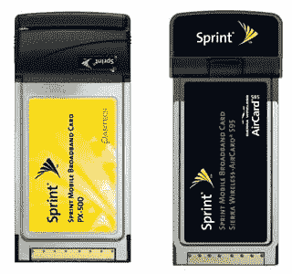

# Sprint 增加了 EV-DO 修订版 A 卡

> 原文：<https://web.archive.org/web/http://techcrunch.com/2006/09/12/sprint-adds-ev-do-revision-a-cards/>

斯普林特公司今天宣布，它将增加两个新的卡，将投诉其即将到来的 EV-DO 修订版 A 升级。新卡是来自 Sierra Wireless 的 Pantech PX-500 和 Aircard 595。这两种卡都支持 450-850 kbps 的速度。PX-500 将以 199.99 美元的价格提供，或者两年期合同免费，而 Aircard 595 的价格为 24.99 美元，或者两年期合同低至 99.99 美元。

[冲刺](https://web.archive.org/web/20160407215436/http://powervision.sprint.com/mobilebroadband/)