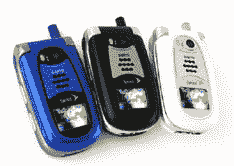

# Sprint 用三洋 SCP-8400 | TechCrunch 瞄准儿童

> 原文：<https://web.archive.org/web/http://techcrunch.com:80/2006/09/12/sprint-aims-for-kiddies-with-the-sanyo-scp-8400/>

# Sprint 以三洋 SCP-8400 为儿童目标

Sprint 终于准备好发布三洋 SCP-8400 了。这款新手机拥有高分辨率的 2 英寸 QVGA 屏幕，可以播放 MP3/ACC，可以在 130 万像素下拍照，当然，还有蓝牙功能。

吸引年轻观众的主要功能是手机能够从 Sprint 的 Power Vision 网络下载和播放音乐和视频——我从未使用过这项服务，但我听说过一些好消息。凭借其 1GB 的存储空间和三种颜色选择，也许有些孩子真的会买这个东西，因为，你知道，孩子们喜欢颜色。

[Sprint 用的三洋 SCP-8400](https://web.archive.org/web/20130627211340/http://www.mobilewhack.com/reviews/sanyo_scp-8400_for_sprint.html)【MobileWhack via[Uber phones](https://web.archive.org/web/20130627211340/http://www.uberphones.com/2006/09/sprint_offers_sanyo_scp8400/)