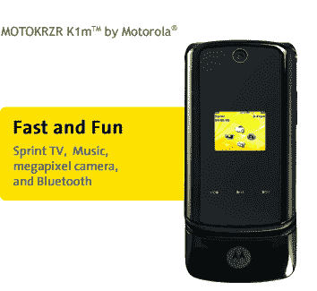

# Sprint 也变得 KRZY

> 原文：<https://web.archive.org/web/http://techcrunch.com/2006/11/06/sprint-gets-krzy-too/>

 [不出所料](https://web.archive.org/web/20210124183711/http://crunchgear.com/2006/10/03/sprint-releasing-motokrzr-motorazr-motoslvr-by-november/)，Sprint 今天正式向其订户提供摩托罗拉 KRZR。对于你们两个不知道，KRZR 是摩托罗拉的普及和细长 RAZR 的续集。你可能有一个，或者至少知道有人有一个。他们越来越讨厌了。那么为什么不把它们变得更令人讨厌呢？

像它的威瑞森兄弟 T4 一样，KRZR(Sprint 称之为 MOTOKRZR)配备了外部触摸感应 mp3 播放按钮、越小越好的外形、蓝牙、扬声器和 130 万像素的摄像头。

如果你仍然在使用 Sprint，尽管几周前我们告诉过你关于的[免罪卡，那么你可以花 199.99 美元买下这款 Moto，如果你足够喜欢它，可以保留它两年。](https://web.archive.org/web/20210124183711/http://crunchgear.com/2006/10/10/sprint-loophole-allows-for-early-exits/)

[MOTOKRZR](https://web.archive.org/web/20210124183711/http://www1.sprintpcs.com/explore/PhonesAccessories/PhoneDetails.jsp?navLocator=%7Cshop%7CphonesAccessories%7CallPhones%7C&selectSkuId=motorolaKRZR&FOLDER%3C%3Efolder_id=1476015&CURRENT_USER%3C%3EATR_SCID=ECOMM&CURRENT_USER%3C%3EATR_PCode=None&CURRENT_USER%3C%3EATR_cartState=group)【PGE】