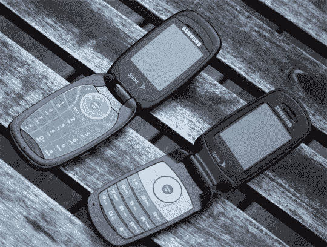
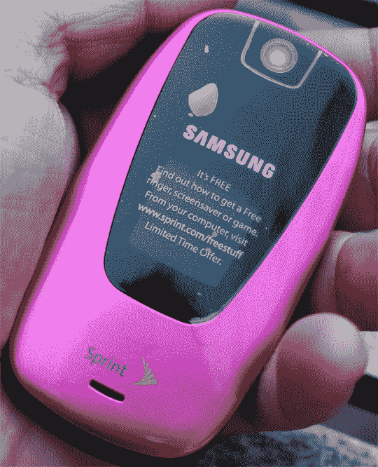
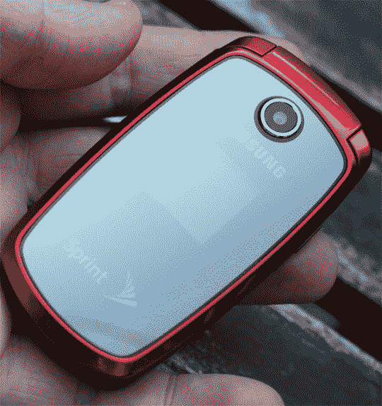

# Sprint 推出两款低端手机，Monsieurs M510 和 M300 

> 原文：<https://web.archive.org/web/http://techcrunch.com/2007/05/16/sprint-launches-two-low-end-phones-monsieurs-m510-and-m300/>

2007 年是手机流畅的一年。例证:Sprint/Samsung 新发布的两款 clamshells。M300 是一款基本款手机，正面采用了巧妙的镜面处理，支持蓝牙和 Spring Vision。VGA 相机，吖哒吖哒。它长 3.6 英寸，提供 3.2 小时的通话时间。有一个外部 96×96 像素的彩色屏幕和一个内部 128×160 像素的屏幕。没有价格或可用性。

M510

然后我们有了 M510。它有点大——3.7 英寸长——有 130 万像素的摄像头，立体声蓝牙，以及 Sprint TV 和 Sprint Music store。它还可以录制和回放音频。

M300
我玩了一下其中的一些功能，对其活泼的 UI 和菜单系统感到惊讶。M510 有一个全新的用户界面，左侧有一组图标，用于 Sprint Vision 和按需访问。我也非常喜欢 M300 的设计。正面几乎是反光的，当你接到电话时，较小的屏幕会透过来。

[产品页面](https://web.archive.org/web/20140424074938/http://www.sprint.com/)