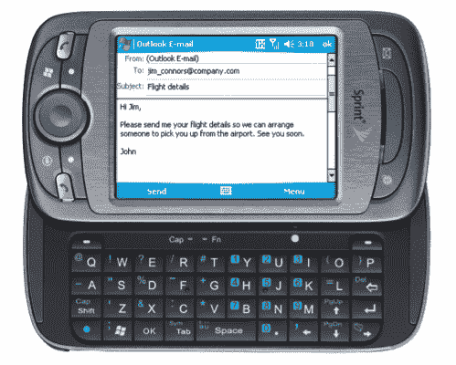

# 短跑大亨:就像短跑孩子的翅膀

> 原文：<https://web.archive.org/web/http://techcrunch.com/2007/06/18/sprint-mogul-like-the-wing-for-the-sprint-kids/>

# 短跑大亨:就像短跑孩子的翅膀

Sprint 刚刚宣布了 ad CDMA/EV-DO 版的 [T-Mobile 的 Wing](https://web.archive.org/web/20130628175933/http://crunchgear.com/2007/05/22/t-mobile-wing-review/) ，这位 HTC 大亨又名“达大亨”这款滑出式智能手机运行 Windows Mobile 6，包括 512MB 存储卡和一个带闪光灯的 200 万像素摄像头，并支持完整的 EV-DO 0 版数据速度。

我们这里的 CG 真的很喜欢翅膀，这基本上是同一种动物，浏览速度更快，电池似乎略好。这款手机在外观上略有不同——对 Sprint 用户来说，没有什么特别之处——但售价 399 美元，将于 7 月上市。这比 wing 贵了 100 美元，但 Sprint 的网络非常热，所以这是你为真正的硬核浏览所付出的代价。

[产品页面](https://web.archive.org/web/20130628175933/http://www.sprint.com/index.html)