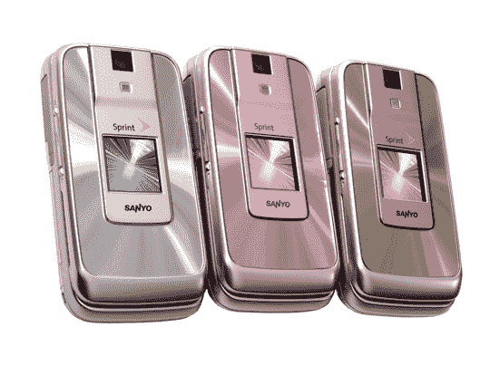
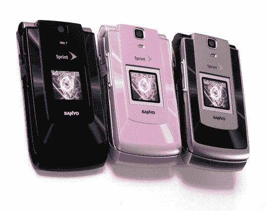

# Sprint 发布两个忍者

> 原文：<https://web.archive.org/web/http://techcrunch.com/2007/07/16/sprint-releases-two-ninjas/>

# Sprint 发布两个忍者

随着武士刀 DLX 和武士刀 II 的发布，Sprint 和三洋带来了最新的时尚和无线连接。武士刀 dos 皮条客 21MB 的存储，一个 VGA 摄像头，语音短信和 Sprint 移动电子邮件。DLX 将摄像头提升到 130 万像素，一个 microSD 插槽和所有你可以要求的在线访问。这两款机型都具有省电模式、网络共享功能、蓝牙、无线备份、GPS 功能和巨大的 QVGA 显示屏。仅需 129.99 美元(两年订阅)就可以拥有武士刀 DLX，并有白金冰、香槟和粉色缎面可供选择。武士刀 dos 仅售 49.99 美元(两年订阅)，有宇宙黑、粉红魅力和午夜钢三种颜色可供选择。

[新闻稿](https://web.archive.org/web/20130628170954/http://www2.sprint.com/mr/news_dtl.do?id=17500)