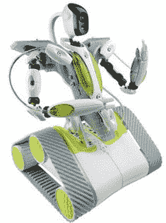

# Spykee 间谍机器人——史上最好的偷窥狂

> 原文：<https://web.archive.org/web/http://techcrunch.com/2007/07/11/spykee-spy-robot-the-best-peeping-tom-ever/>

《洛基四》里的那个机器人烂透了。你知道我说的那个。它只会讲蹩脚的笑话，给人们带来啤酒——有点像彼得。现在是 2007 年，Spykee 间谍机器人是镇上新的热门机器人。这个坏男孩配有坦克履带、WiFi、相机和麦克风，这样你就可以进行自己的芭芭拉·沃尔特斯采访，而不会有肉毒杆菌汁喷到你衬衫上的风险。

哦，我有没有提到 Spykee 附带的 Skype 兼容性和运动检测器？有了内置摄像头和麦克风，你完全可以通过机器人与任何人进行 Skype 通话。他也玩 MP3。如果这都不酷，那我就不知道什么才酷了。令人惊讶的是，世爵并没有那么贵。只需 388 美元，你就可以在更衣室里轻松勾搭女人而不会被抓到。

[世爵间谍机器人——你的移动闭路电视 Skype 好友](https://web.archive.org/web/20150927231931/http://www.redferret.net/?p=8995)【红鼬】