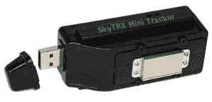

# 使用新的 SkyTRX 迷你追踪器轻松跟踪

> 原文：<https://web.archive.org/web/http://techcrunch.com/2006/09/11/stalking-made-easy-with-new-skytrx-mini-tracker/>

有了新的 SkyTRX 迷你追踪器，成为跟踪者比以往任何时候都容易。这首小曲使用 GPS 追踪你的目标，精确度高达 2.5 米。那很好。这个箱子是防风雨的，所以你可以用磁铁把它固定在别人的车上，然后就可以走了。它需要 2 节 AAA 电池来运行，当汽车关闭时，它就会关闭，这非常漂亮；你可以用谷歌地球查看信息。所以下次你的女朋友*说*她要去拜访她的父母，你只需要花 300 美元就可以确定。

[SkyTRX 迷你追踪器](https://web.archive.org/web/20150628135215/http://www.coolest-gadgets.com/20060910/skytrx-mini-tracker/)【通过 [Ubergizmo](https://web.archive.org/web/20150628135215/http://www.ubergizmo.com/15/archives/2006/09/skytrx_mini_tracker.html) 最酷的小工具】