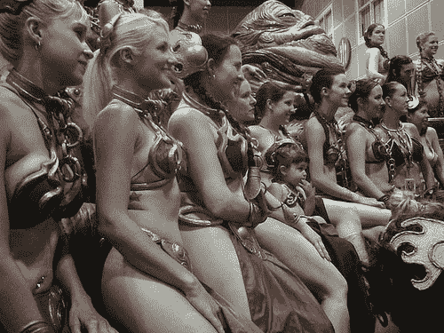

# 《星球大战》正在步入中年，面临危机

> 原文：<https://web.archive.org/web/http://techcrunch.com/2007/05/28/star-wars-inches-toward-middle-age-has-a-crisis/>

图片来自 [Bonniegrrl](https://web.archive.org/web/20151006074729/http://www.flickr.com/photos/bonniegrrl/)
《星球大战》30 周年纪念于本周末举行，招待了各种各样的书呆子。今天我整理了一些图片和视频(我没有生活)，发现了一个，嗯，引起了我的兴趣。上图描绘的可能是世界上有史以来最大规模的奴隶集会。加上一个全尺寸的贾巴小屋，它几乎很大(我从来没见过)。

据地面上的书呆子说，也有相当数量的人类奴隶莱娅，幸运的是，在下面的视频中没有:

 [星球大战庆典 IV 博客](https://web.archive.org/web/20151006074729/http://starwarsblog.wordpress.com/2007/05/26/fanboy-heaven/)