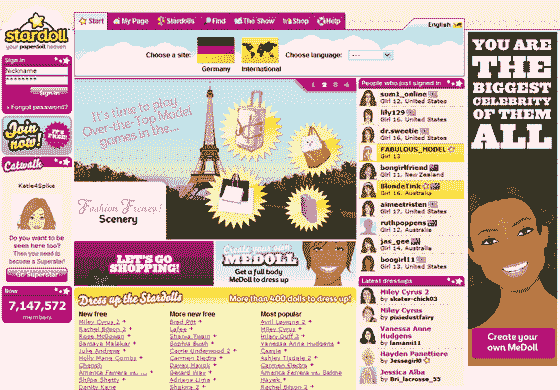

# Stardoll.com:大事从小事开始——TechCrunch

> 原文：<https://web.archive.org/web/http://www.techcrunch.com:80/2007/05/08/stardollcom-from-little-things-big-things-grow/>

受儿时对纸娃娃的热情的启发，出生于斯堪的纳维亚的 Liisa 开始画娃娃和相应的衣柜，并将它们上传到 Geocities。2004 年，个人主页发展成为纸娃娃天堂。

现在自称为[Stardoll.com](https://web.archive.org/web/20220629011845/http://www.stardoll.com/)，该网站在 2006 年 2 月从 [Index Ventures](https://web.archive.org/web/20220629011845/http://www.indexventures.com/cgi-local/ivw_home.cgi) 获得了 400 万美元的首轮融资，同年 6 月在由红杉[牵头的 B 轮融资中获得了 600 万美元。](https://web.archive.org/web/20220629011845/http://www.sequoiacap.com/)

这是一个从贫穷到富有的成功故事，这使得 Stardoll 值得一看，这个领域正在飞速发展。请看我们上周对 Zwinky 的报道。

Stardoll 就是在网上打扮娃娃。

Stardoll 允许用户创建他们自己的娃娃，或者从一大堆名人娃娃中选择，然后这些娃娃可以穿上虚拟时装。每个名人娃娃都有一个装满独特衣服和服装的衣柜，每周都有新的名人娃娃和服装发布。

每个用户都有一个页面，他们可以在那里分享他们创造的娃娃，并附有留言簿、日记(博客)、朋友联系和相册。

大多数用户是 10 至 17 岁的女孩，在线安全立即成为一个考虑因素。Stardoll 为所有账户增加了一层匿名性。用户永远不能在他们的页面上透露个人信息，如真实姓名或原籍城市。

第一次加入该网站时，你可以用 25 星币为每个虚拟娃娃购买配件。配件价格从 1-35 星美元不等，用户可以以 10 星美元到 1 美元的价格购买额外的星美元。

他们目前每天销售 6 万到 18 万件商品。

背景是一个已经发展到 40 人的团队，总部设在斯德哥尔摩，洛杉矶办事处即将成立。前迪士尼儿童网络营销副总裁马特·帕尔默受聘领导北美推广工作。

Stardoll 拥有 7，144，735 名会员，每天增加 20，000 名新会员，每月有 550 万独立访客。

凭借其欧洲传统，支持的语言包括法语、意大利语、西班牙语、匈牙利语和波兰语，以及专用的德语。de 版本最近正在推出。30%的流量来自美国，50-52%来自欧盟。

作为一个目的地，这不会吸引所有的读者，尤其是在技术领域工作的男性，然而这些数字充分说明了他们在目标人群中日益增长的成功。红杉是它的投资者之一，它并不需要火箭科学来计算出这个网站看起来像一个赢家。

还有一个积极的信息。

追逐资金并试图成为 Web 2.0 中下一个最好的东西有时会很难，甚至有点沮丧。Stardoll 向我们展示了从小事情开始，大事情可以成长。

