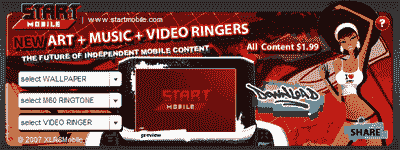

# 启动手机，让你的手机焕然一新

> 原文：<https://web.archive.org/web/http://techcrunch.com/2007/06/12/start-mobile-to-pimp-out-your-phone/>

呦，呦，呦！独立移动内容公司 START MOBILE 今天宣布推出他们的新移动小部件，该部件由 XLR8 Mobile 的 WapItUp 提供支持！移动商务平台，将从任何网站向任何地方的手机传送移动内容。这是通过他们专有的商业系统来完成的，该系统有一个微型网站小部件店面。

《JUXTAPOZ》杂志的前编辑杰米·奥谢(Jamie O'Shea)说，“启动移动小工具是一个非常进步的概念。”他的 SUPERTOUCHBLOG.COM 和新杂志《传播艺术+文化》(SPREAD ART+CULTURE)是前沿艺术世界新闻的主要资源。“这项服务将一些当今最相关的现代流行艺术家的图像放在人们的口袋里，将手机变成廉价的便携式美术馆。”

START Mobile 小工具的特点是通常的壁纸、铃声和视频铃声的混合。把它想象成你手机上的珠宝吧！

[start MOBILE](https://web.archive.org/web/20160421222728/http://www.startmobile.com/)
 [XLR 8 MOBILE](https://web.archive.org/web/20160421222728/http://www.xlr8mobile.com/)