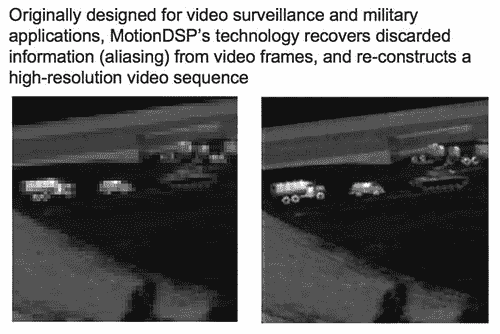

# 初创公司使用军事技术修复低分辨率视频 

> 原文：<https://web.archive.org/web/http://www.techcrunch.com:80/2006/08/31/startup-uses-military-tech-to-fix-low-res-video/>

# 初创公司使用军事技术修复低分辨率视频

  [Motion DSP](https://web.archive.org/web/20221205084348/http://www.motiondsp.com/) 正在创建一个简单的基于网络的界面，它将显著增强低分辨率相机手机视频到令人惊讶的高质量的东西。它始于 1998 年，是美国军方在加州大学圣克鲁斯分校资助的项目。2005 年 1 月，Peyman Milanfar 教授，这项技术背后的主要研究人员，共同创立了运动 DSP。

该公司比较视频中的多个帧，以找到并替换给定帧中丢失的像素，在压缩后文件大小几乎没有增加的情况下，显著增强了体验。这项服务在视频移动速度不快或不稳定的时候效果最好，但有助于改善任何低质量的视频。要观看演示，请查看网站上包含三个不同的前后视频镜头的页面。

首席执行官兼联合创始人肖恩·瓦拉告诉我们，这项服务将在今年的某个时候进入消费者测试阶段。这项服务将是免费的，允许用户上传视频和下载增强版。但他也强调，重点将是与 YouTube 等大型在线视频网站达成交易，以增强用户上传的视频。

Motion DSP 总部位于加州圣马特奥，并将大部分软件开发外包给塞尔维亚。他们已经筹集了 50 万美元的天使轮资金，目前正在进行首轮融资。

