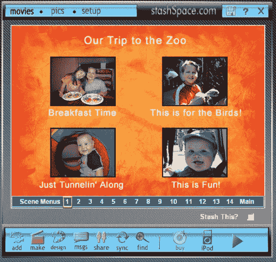

# StashSpace 将全长在线视频编辑带给大众 TechCrunch

> 原文：<https://web.archive.org/web/http://www.techcrunch.com:80/2006/10/02/stashspace-to-take-full-length-online-video-editing-to-the-masses>

# StashSpace 将把完整长度的在线视频编辑带给大众

  在线视频存储、编辑和管理服务 [StashSpace](https://web.archive.org/web/20221208221141/http://stashspace.com/) 将于周三进行全面的公开发布和媒体发布。不像我们看到的许多服务专注于短格式视频，如 [Jumpcut](https://web.archive.org/web/20221208221141/http://jumpcut.com/) (a [ Yahoo！StashSpace 允许用户在浏览器中处理长电影。它易于使用，具有良好的定价结构，并针对大型市场中的明确痛点。Shutterfly 上周 8700 万美元的首次公开募股进一步证明，面向非技术用户的轻松在线多媒体存储是一个准备起飞的市场。](https://web.archive.org/web/20221208221141/https://beta.techcrunch.com/tag/Jumpcut)

用户通过 StashSpace 网站上传任意长度的视频，然后选择他们想要保存的剪辑，并以 ActiveX 插件的形式构建工作空间。保存的视频可以在网站上编辑、分享和观看。它可能不是网上最耀眼的公司，但我认为鉴于消费视频市场的发展方向，StashSpace 的战略是明智的。

由约翰·拉森、拉尔斯·克鲁姆和史蒂夫·斯莫尔曼创建的 Stashspace 位于西雅图郊外。该公司的资金来源于联合创始人在 90 年代末的技术工作和过去 7 年来自他们相关网站[homemovie.com](https://web.archive.org/web/20221208221141/http://homemovie.com/)的收入。StashSpace 是该公司软件的第四个主要版本，现在已经更新并更名为无处不在的宽带和廉价在线存储时代。
 *一个关键的区别点是*该公司将以每盘 5 美元的价格将录像带数字化、转码并放到网上。这比该公司的大多数竞争对手便宜得多——他们说对他们来说这是一个异常自动化的过程。DVD 售价 15 美元，另外加 4 美元就可以买到个性化封面。

Krumme 告诉我，他们相信模拟视频有着巨大的市场，非技术用户会愿意数字化，放到网上，编辑和分享。让这变得简单又便宜对我来说是一个很好的策略。在此次面向消费者用户的发布之前，该公司的主要分销渠道是婚礼摄像师和新婚夫妇。消费者视频创作现在变得足够流行，以至于扩大用户群非常有意义，而且大多数服务仍然专注于短片。让自己出名可能是该公司面临的最大挑战。

StashSpace 的编辑功能非常好，从网上上传的每个视频都有 100 个屏幕帽，用户可以从这些屏幕截图标记的时间轴中剪辑部分。剪报可以拖到剪贴板上，可以从每个选项中选择新的截图和标题。很容易将视频片段从一个文件复制到另一个文件，添加照片和字幕。这是一个非常流畅的在线编辑器，适合大文件。该软件支持标记，我相信这对于导航来说很棒，即使对于非技术用户来说也是如此。

存储费用通过代币支付，每 5 分钟的费用在 25 到 40 美分之间。这意味着在线存储一小时的视频每年最多需要 8 美元。用户在分享视频和尝试新功能时可以获得免费代币；下载视频到 iPod 格式需要 1 个代币。提供无限量的 Windows Media 格式视频文件是免费的。还有一个小工具可以用来在社交网站上显示你的视频。

该服务目前主要面向 Windows/IE，不过也有一些基本的 Mac 和 Firefox 支持，全部功能预计将于明年年初推出。在这种情况下，我会对使用这项服务更感兴趣，但世界就是这样，Windows 不会阻止他们在销售方面取得好成绩。

这种功能有许多竞争者，但主要的目标用户是对简单、长格式的在线视频编辑感兴趣的用户，可能是[onerumedia](https://web.archive.org/web/20221208221141/http://onetruemedia.com/)([我们的报道](https://web.archive.org/web/20221208221141/http://www.beta.techcrunch.com/tag/One-True-Media/))。OneTrueMedia 的界面非常不同，他们的价格更高，他们有风险投资支持，并与强生公司的 BabyCenter.com 等网站建立了更多的在线商业合作关系。我认为模拟到数字转换、编辑和 DVD 制作市场对两家公司来说都足够大。不过，StashSpace 的定价可能会给竞争对手带来压力，这是好事。

披露:StashSpace 是 T4 TechCrunch 7 派对 T5 的赞助商。

