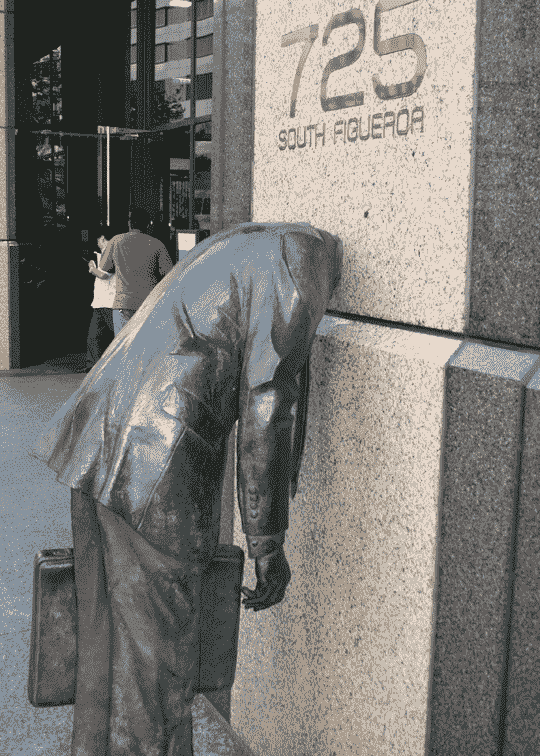
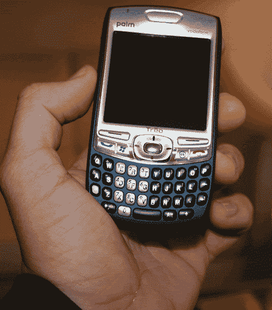

# CTIA 联盟| TechCrunch

> 原文：<https://web.archive.org/web/http://techcrunch.com/2006/09/12/state-of-the-ctia-union/>

嗨嗬。现在洛杉矶大约是下午 3 点，我们正从今天早上开始的旋风般的会议中逐渐放松下来。加上苹果公司的公告——嗯，除了独立电视——嘎吱嘎吱作响的机器被打败了！

这是今天节目的快速回顾。 [QuickPlay](https://web.archive.org/web/20160526203210/http://crunchgear.com/2006/09/12/quickplayer-update-mmmm-video/) 向我们展示了这个视频/音频流解决方案，而[诺基亚用他们在 60 系列手机上发布的新 N-Gage 平台让](https://web.archive.org/web/20160526203210/http://crunchgear.com/2006/09/12/nokia-n-gage/)我们大吃一惊。

我们看到了 Sprint 的新网卡和一款新手机，一款国际 Windows Mobile 手机，IP-830W。这是一个相当大的 Windows Mobile 滑块。我们说话的时候试着抓拍一些图像。我们还看到了 [Palm 750v](https://web.archive.org/web/20160526203210/http://crunchgear.com/2006/09/12/palm-750-unveiled/) ，配有火辣的公关小姐。

不然这个节目更多的是关于企业和 GPS。每个人和他们的狗都有某种流媒体视频解决方案，每个人都想在苹果开始之前将媒体和电视传输到手机上。

Symbian 向我们展示了他们的一些产品，但我们明天将再次与他们见面。这里我们看到一堆 UIQ 手机在野外。

一旦我们的报道合作伙伴 [SlashPhone](https://web.archive.org/web/20160526203210/http://www.slashphone.com/) 对其进行处理，今晚我们将有一些精彩的镜头。